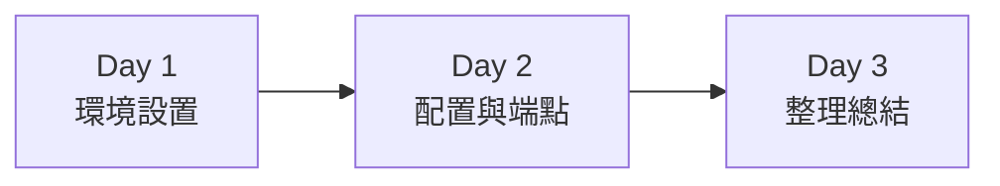

# 模組 01: Spring Boot 基礎應用

> 📚 **學習目標**: 掌握 Spring Boot 基礎概念與 TDD 開發流程  
> ⏱️ **預計時間**: 3 天（Day 1-3）  
> 🎯 **難度**: ⭐ 入門級

## 學習路徑



---

## Day 1: 環境設置與第一個應用

**學習目標**:
- [ ] 理解什麼是 Spring Boot
- [ ] 設置開發環境
- [ ] 建立並運行第一個 Spring Boot 應用

**今日任務**:
- [ ] 安裝 JDK 17、Maven 3.8+、IDE
- [ ] 使用 Spring Initializr 建立專案
- [ ] **🔴 TDD Step 1**: 寫 HelloController 測試
- [ ] **🟢 TDD Step 2**: 實作 HelloController
- [ ] **🔵 TDD Step 3**: 重構並加入註解
- [ ] 成功啟動應用

### TDD 實作流程

#### 步驟 1 - 🔴 先寫測試

```java
@WebMvcTest(HelloController.class)
class HelloControllerTest {
    
    @Autowired
    private MockMvc mockMvc;
    
    @Test
    void should_ReturnGreeting_When_NoNameProvided() throws Exception {
        mockMvc.perform(get("/hello"))
            .andExpect(status().isOk())
            .andExpect(content().string("你好，世界！"));
    }
    
    @Test
    void should_ReturnCustomGreeting_When_NameProvided() throws Exception {
        mockMvc.perform(get("/hello").param("name", "小明"))
            .andExpect(status().isOk())
            .andExpect(content().string("你好，小明！"));
    }
}
```
執行測試 → 應該失敗（紅燈），因為還沒有 Controller

#### 步驟 2 - 🟢 寫實作讓測試通過

```java
@RestController
public class HelloController {
    @GetMapping("/hello")
    public String hello(@RequestParam(defaultValue = "世界") String name) {
        return "你好，" + name + "！";
    }
}
```
執行測試 → 應該成功（綠燈）

#### 步驟 3 - 🔵 重構

```java
@RestController
public class HelloController {
    
    /**
     * 問候端點
     * @param name 要問候的名字，預設為「世界」
     * @return 問候訊息
     */
    @GetMapping("/hello")
    public String hello(@RequestParam(defaultValue = "世界") String name) {
        return String.format("你好，%s！", name);
    }
}
```
執行測試 → 確保仍然成功

### 評量標準

- [ ] 環境安裝完成
- [ ] 測試先於實作編寫
- [ ] 所有測試通過
- [ ] 應用成功啟動在 http://localhost:8080
- [ ] `/hello` 端點正常回應

---

## Day 2: 配置檔案與多個端點

**學習目標**:
- [ ] 學會使用 `application.yml` 配置
- [ ] 建立多個 REST 端點
- [ ] 使用 `@Value` 讀取配置值

**今日任務**:
- [ ] 建立 `application.yml`
- [ ] **🔴 TDD**: 先寫時間端點測試
- [ ] **🟢 TDD**: 實作時間端點
- [ ] **🔴 TDD**: 先寫配置讀取測試
- [ ] **🟢 TDD**: 實作配置讀取功能
- [ ] **🔵 TDD**: 重構與優化
- [ ] 整合 Spring Boot Actuator

### TDD 範例 - 時間端點

#### 🔴 先寫測試

```java
@WebMvcTest(TimeController.class)
class TimeControllerTest {
    
    @Autowired
    private MockMvc mockMvc;
    
    @Test
    void should_ReturnCurrentTime_When_CallTimeEndpoint() throws Exception {
        mockMvc.perform(get("/time"))
            .andExpect(status().isOk())
            .andExpect(content().string(containsString("現在時間：")));
    }
}
```

#### 🟢 寫實作

```java
@RestController
public class TimeController {
    @GetMapping("/time")
    public String getCurrentTime() {
        LocalDateTime now = LocalDateTime.now();
        DateTimeFormatter formatter = DateTimeFormatter.ofPattern("yyyy-MM-dd HH:mm:ss");
        return "現在時間：" + now.format(formatter);
    }
}
```

### TDD 範例 - 配置讀取

#### 🔴 先寫測試

```java
@WebMvcTest(WelcomeController.class)
@TestPropertySource(properties = {"app.welcome-message=測試訊息"})
class WelcomeControllerTest {
    
    @Autowired
    private MockMvc mockMvc;
    
    @Test
    void should_ReturnConfiguredMessage_When_CallWelcome() throws Exception {
        mockMvc.perform(get("/welcome"))
            .andExpect(status().isOk())
            .andExpect(content().string("測試訊息"));
    }
}
```

#### 🟢 寫實作

```java
@RestController
public class WelcomeController {
    
    @Value("${app.welcome-message}")
    private String welcomeMessage;
    
    @GetMapping("/welcome")
    public String welcome() {
        return welcomeMessage;
    }
}
```

### 實作練習（都要先寫測試）

1. **🔴** 先寫測試：`/date` 端點應回傳今天日期
2. **🟢** 寫實作讓測試通過
3. **🔴** 先寫測試：`/week` 端點應回傳星期幾
4. **🟢** 寫實作讓測試通過

### 評量標準

- [ ] 所有功能都先寫測試再實作
- [ ] 測試覆蓋率 > 80%
- [ ] 所有測試通過
- [ ] 理解 YAML 配置格式
- [ ] Actuator 健康檢查成功

---

## Day 3: 整理與總結

**學習目標**:
- [ ] 複習 Spring Boot 核心概念
- [ ] 編寫完整的模組文件
- [ ] 理解自動配置原理

**今日任務**:
- [ ] 整理程式碼並加入註解
- [ ] 完成所有測試
- [ ] 檢查測試覆蓋率

### 複習重點

- `@SpringBootApplication` = 三個註解的組合
- `@RestController` 定義 REST 控制器
- `application.yml` 管理應用配置
- Actuator 提供健康檢查
- **TDD 循環**: 🔴 測試 → 🟢 實作 → 🔵 重構

### TDD 最佳實踐總結

1. ✅ 永遠先寫測試
2. ✅ 測試要能清楚表達需求
3. ✅ 一次只測試一個功能
4. ✅ 看到綠燈才寫下一個測試
5. ✅ 重構時保持測試通過

### 評量標準

- [ ] README 文件完整
- [ ] 理解 Spring Boot 基本概念
- [ ] 掌握 TDD 開發流程
- [ ] 所有功能都有測試覆蓋
- [ ] 能獨立建立 Spring Boot 專案

---

## 快速開始

### 前置需求

- JDK 17+
- Maven 3.8+
- IDE (IntelliJ IDEA / VS Code)

### 啟動步驟

```bash
# 編譯專案
mvn clean install

# 啟動應用
mvn spring-boot:run

# 執行測試
mvn test
```

### 訪問應用

- 應用主頁：http://localhost:8080
- Hello 端點：http://localhost:8080/hello
- 健康檢查：http://localhost:8080/actuator/health

---

## 程式碼結構

```
01-basic-spring-boot/
├── src/
│   ├── main/
│   │   ├── java/com/petlearning/basic/
│   │   │   ├── BasicApplication.java
│   │   │   └── controller/
│   │   │       ├── HelloController.java
│   │   │       ├── TimeController.java
│   │   │       └── WelcomeController.java
│   │   └── resources/
│   │       └── application.yml
│   └── test/
│       └── java/com/petlearning/basic/
│           └── controller/
│               ├── HelloControllerTest.java
│               ├── TimeControllerTest.java
│               └── WelcomeControllerTest.java
├── pom.xml
└── README.md
```

---

## 下一步

完成本模組後，繼續學習：
- **模組 02**: Spring Data JPA - 資料持久化
- **模組 03**: RESTful API 設計

---

## 參考資源

- [Spring Boot 官方文件](https://spring.io/projects/spring-boot)
- [Spring Boot 教學](https://spring.io/guides/gs/spring-boot/)
- [測試驅動開發（TDD）指南](https://martinfowler.com/bliki/TestDrivenDevelopment.html)
