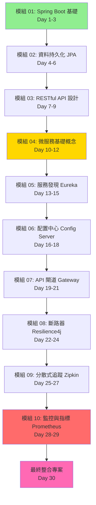

# Spring Boot / Spring Cloud 微服務學習計劃

> 🎯 **目標讀者**: 高中生程度，具備基礎 Java 語法知識  
> 📚 **學習方式**: 漸進式、實作導向、每個模組獨立可執行  
> ⏱️ **預計學習時間**: 30 天（每天 2-3 小時）

## 學習路徑總覽



**圖例說明**:
- 🟢 綠色：基礎模組（Day 1-9）
- 🟡 黃色：微服務入門（Day 10-12）
- 🔴 紅色：進階整合（Day 28-29）
- 🔵 粉色：綜合實作（Day 30）

---

## 📋 各模組工作清單

> ⚠️ **重要**: 所有功能開發必須採用 **TDD（測試驅動開發）**方式進行  
> 🔴 先寫測試 → 🟢 再寫實作 → 🔵 最後重構

### TDD 開發流程說明

每個功能都要遵循以下步驟：

1. **🔴 Red（寫測試，測試失敗）**
   - 先寫測試案例，描述預期行為
   - 執行測試，確認失敗（紅燈）
   
2. **🟢 Green（寫實作，測試通過）**
   - 寫最簡單的程式碼讓測試通過
   - 執行測試，確認成功（綠燈）
   
3. **🔵 Refactor（重構，保持測試通過）**
   - 優化程式碼品質
   - 重新執行測試，確保仍然通過

---

### 模組 01: Spring Boot 基礎應用 (Day 1-3)

#### Day 1: 環境設置與第一個應用

**學習目標**:
- [ ] 理解什麼是 Spring Boot
- [ ] 設置開發環境
- [ ] 建立並運行第一個 Spring Boot 應用

**今日任務**:
- [ ] 安裝 JDK 17、Maven 3.8+、IDE
- [ ] 使用 Spring Initializr 建立專案
- [ ] **🔴 TDD Step 1**: 寫 HelloController 測試
- [ ] **🟢 TDD Step 2**: 實作 HelloController
- [ ] **🔵 TDD Step 3**: 重構並加入註解
- [ ] 成功啟動應用

**TDD 實作流程**:

**步驟 1 - 🔴 先寫測試**:
```java
@WebMvcTest(HelloController.class)
class HelloControllerTest {
    
    @Autowired
    private MockMvc mockMvc;
    
    @Test
    void should_ReturnGreeting_When_NoNameProvided() throws Exception {
        mockMvc.perform(get("/hello"))
            .andExpect(status().isOk())
            .andExpect(content().string("你好，世界！"));
    }
    
    @Test
    void should_ReturnCustomGreeting_When_NameProvided() throws Exception {
        mockMvc.perform(get("/hello").param("name", "小明"))
            .andExpect(status().isOk())
            .andExpect(content().string("你好，小明！"));
    }
}
```
執行測試 → 應該失敗（紅燈），因為還沒有 Controller

**步驟 2 - 🟢 寫實作讓測試通過**:
```java
@RestController
public class HelloController {
    @GetMapping("/hello")
    public String hello(@RequestParam(defaultValue = "世界") String name) {
        return "你好，" + name + "！";
    }
}
```
執行測試 → 應該成功（綠燈）

**步驟 3 - 🔵 重構**:
```java
@RestController
public class HelloController {
    
    /**
     * 問候端點
     * @param name 要問候的名字，預設為「世界」
     * @return 問候訊息
     */
    @GetMapping("/hello")
    public String hello(@RequestParam(defaultValue = "世界") String name) {
        return String.format("你好，%s！", name);
    }
}
```
執行測試 → 確保仍然成功

**評量標準**:
- [ ] 環境安裝完成
- [ ] 測試先於實作編寫
- [ ] 所有測試通過
- [ ] 應用成功啟動在 http://localhost:8080
- [ ] `/hello` 端點正常回應

---

#### Day 2: 配置檔案與多個端點

**學習目標**:
- [ ] 學會使用 `application.yml` 配置
- [ ] 建立多個 REST 端點
- [ ] 使用 `@Value` 讀取配置值

**今日任務**:
- [ ] 建立 `application.yml`
- [ ] **🔴 TDD**: 先寫時間端點測試
- [ ] **🟢 TDD**: 實作時間端點
- [ ] **🔴 TDD**: 先寫配置讀取測試
- [ ] **🟢 TDD**: 實作配置讀取功能
- [ ] **🔵 TDD**: 重構與優化
- [ ] 整合 Spring Boot Actuator

**TDD 範例 - 時間端點**:

**🔴 先寫測試**:
```java
@WebMvcTest(TimeController.class)
class TimeControllerTest {
    
    @Autowired
    private MockMvc mockMvc;
    
    @Test
    void should_ReturnCurrentTime_When_CallTimeEndpoint() throws Exception {
        mockMvc.perform(get("/time"))
            .andExpect(status().isOk())
            .andExpect(content().string(containsString("現在時間：")));
    }
}
```

**🟢 寫實作**:
```java
@RestController
public class TimeController {
    @GetMapping("/time")
    public String getCurrentTime() {
        LocalDateTime now = LocalDateTime.now();
        DateTimeFormatter formatter = DateTimeFormatter.ofPattern("yyyy-MM-dd HH:mm:ss");
        return "現在時間：" + now.format(formatter);
    }
}
```

**TDD 範例 - 配置讀取**:

**🔴 先寫測試**:
```java
@WebMvcTest(WelcomeController.class)
@TestPropertySource(properties = {"app.welcome-message=測試訊息"})
class WelcomeControllerTest {
    
    @Autowired
    private MockMvc mockMvc;
    
    @Test
    void should_ReturnConfiguredMessage_When_CallWelcome() throws Exception {
        mockMvc.perform(get("/welcome"))
            .andExpect(status().isOk())
            .andExpect(content().string("測試訊息"));
    }
}
```

**🟢 寫實作**:
```java
@RestController
public class WelcomeController {
    
    @Value("${app.welcome-message}")
    private String welcomeMessage;
    
    @GetMapping("/welcome")
    public String welcome() {
        return welcomeMessage;
    }
}
```

**實作練習**（都要先寫測試）:
1. **🔴** 先寫測試：`/date` 端點應回傳今天日期
2. **🟢** 寫實作讓測試通過
3. **🔴** 先寫測試：`/week` 端點應回傳星期幾
4. **🟢** 寫實作讓測試通過

**評量標準**:
- [ ] 所有功能都先寫測試再實作
- [ ] 測試覆蓋率 > 80%
- [ ] 所有測試通過
- [ ] 理解 YAML 配置格式
- [ ] Actuator 健康檢查成功

---

#### Day 3: 整理與總結

**學習目標**:
- [ ] 複習 Spring Boot 核心概念
- [ ] 編寫完整的模組文件
- [ ] 理解自動配置原理

**今日任務**:
- [ ] 整理程式碼並加入註解
- [ ] 編寫 README.md
- [ ] 測試所有功能

**複習重點**:
- `@SpringBootApplication` = 三個註解的組合
- `@RestController` 定義 REST 控制器
- `application.yml` 管理應用配置
- Actuator 提供健康檢查
- **TDD 循環**: 🔴 測試 → 🟢 實作 → 🔵 重構

**TDD 最佳實踐總結**:
1. ✅ 永遠先寫測試
2. ✅ 測試要能清楚表達需求
3. ✅ 一次只測試一個功能
4. ✅ 看到綠燈才寫下一個測試
5. ✅ 重構時保持測試通過

**評量標準**:
- [ ] README 文件完整
- [ ] 理解 Spring Boot 基本概念
- [ ] 掌握 TDD 開發流程
- [ ] 所有功能都有測試覆蓋
- [ ] 能獨立建立 Spring Boot 專案

---

### 模組 02: 資料持久化與 Spring Data JPA (Day 4-6)

#### Day 4: H2 資料庫與第一個實體（TDD 實作）

**學習目標**:
- [ ] 理解 ORM 概念
- [ ] 認識 H2 記憶體資料庫
- [ ] 建立第一個 JPA 實體（測試先行）

**理論講解** (30 分鐘):
- ORM（物件關聯映射）是什麼？
- JPA 規範與 Hibernate 實作
- H2 資料庫特性與應用場景
- Entity 生命週期

**TDD 實作** (90 分鐘):

1. **🔴 Red - 寫實體測試**
   ```java
   // OwnerTest.java
   class OwnerTest {
       @Test
       void should_CreateOwner_With_RequiredFields() {
           Owner owner = new Owner("小明", "王");
           owner.setCity("台北市");
           owner.setTelephone("0912345678");
           
           assertThat(owner.getFirstName()).isEqualTo("小明");
           assertThat(owner.getLastName()).isEqualTo("王");
           assertThat(owner.getCity()).isEqualTo("台北市");
       }
       
       @Test
       void should_ThrowException_When_NameIsNull() {
           assertThatThrownBy(() -> new Owner(null, "王"))
               .isInstanceOf(IllegalArgumentException.class);
       }
   }
   ```

2. **🟢 Green - 建立 Owner 實體**
   ```java
   @Entity
   @Table(name = "owners")
   public class Owner {
       @Id
       @GeneratedValue(strategy = GenerationType.IDENTITY)
       private Long id;
       
       @Column(nullable = false, length = 50)
       private String firstName;
       
       @Column(nullable = false, length = 50)
       private String lastName;
       
       private String city;
       private String telephone;
       
       public Owner(String firstName, String lastName) {
           if (firstName == null || lastName == null) {
               throw new IllegalArgumentException("姓名不可為空");
           }
           this.firstName = firstName;
           this.lastName = lastName;
       }
       
       // Protected 無參建構子（JPA 需要）
       protected Owner() {}
       
       // Getters and Setters
   }
   ```

3. **🔵 Refactor - 加入驗證邏輯**
   - 使用 Bean Validation (`@NotBlank`, `@Size`)
   - 測試驗證規則是否正確運作

**配置 H2** (30 分鐘):
```yaml
spring:
  datasource:
    url: jdbc:h2:mem:petdb
    driverClassName: org.h2.Driver
  h2:
    console:
      enabled: true
      path: /h2-console
  jpa:
    show-sql: true
    hibernate:
      ddl-auto: create-drop
```

**實作練習**:
- [ ] 先寫測試：驗證電話號碼格式
- [ ] 實作電話號碼驗證邏輯
- [ ] 訪問 H2 Console 確認資料表結構
- [ ] 所有測試通過

**評量標準**:
- [ ] 所有測試先寫再實作
- [ ] H2 Console 可訪問
- [ ] `owners` 表自動建立
- [ ] 測試覆蓋率 > 90%

---

#### Day 5: Repository 與 CRUD 操作（TDD 實作）

**學習目標**:
- [ ] 掌握 JpaRepository 使用方式
- [ ] 理解衍生查詢（Derived Query）
- [ ] 測試資料庫操作（@DataJpaTest）

**理論講解** (30 分鐘):
- JpaRepository 提供的方法
- 衍生查詢命名規則
- `@DataJpaTest` 測試註解

**TDD 實作** (90 分鐘):

1. **🔴 Red - 寫 Repository 測試**
   ```java
   @DataJpaTest
   class OwnerRepositoryTest {
       @Autowired
       private OwnerRepository repository;
       
       @Test
       void should_SaveAndRetrieveOwner() {
           Owner owner = new Owner("小明", "王");
           owner.setCity("台北市");
           
           Owner saved = repository.save(owner);
           Owner found = repository.findById(saved.getId()).orElseThrow();
           
           assertThat(found.getId()).isNotNull();
           assertThat(found.getFirstName()).isEqualTo("小明");
           assertThat(found.getCity()).isEqualTo("台北市");
       }
       
       @Test
       void should_FindOwnersByLastName() {
           repository.save(new Owner("小明", "王"));
           repository.save(new Owner("小華", "王"));
           repository.save(new Owner("小美", "李"));
           
           List<Owner> wangs = repository.findByLastName("王");
           
           assertThat(wangs).hasSize(2);
           assertThat(wangs).extracting("lastName")
               .containsOnly("王");
       }
       
       @Test
       void should_FindOwnersByCity() {
           repository.save(new Owner("小明", "王").setCity("台北市"));
           repository.save(new Owner("小華", "李").setCity("台北市"));
           repository.save(new Owner("小美", "陳").setCity("台中市"));
           
           List<Owner> taipei = repository.findByCity("台北市");
           
           assertThat(taipei).hasSize(2);
       }
       
       @Test
       void should_DeleteOwner() {
           Owner owner = repository.save(new Owner("小明", "王"));
           Long id = owner.getId();
           
           repository.deleteById(id);
           
           assertThat(repository.findById(id)).isEmpty();
       }
   }
   ```

2. **🟢 Green - 建立 Repository**
   ```java
   @Repository
   public interface OwnerRepository extends JpaRepository<Owner, Long> {
       List<Owner> findByLastName(String lastName);
       List<Owner> findByCity(String city);
   }
   ```

3. **🔵 Refactor - 優化測試**
   - 使用 `@BeforeEach` 建立測試資料
   - 提取共用的測試資料建立方法
   - 加入更多邊界條件測試

**實作練習** (30 分鐘):
- [ ] 測試：查詢姓名包含特定字串的飼主
- [ ] 實作：`findByFirstNameContaining()`
- [ ] 測試：查詢所有飼主並排序
- [ ] 實作：`findAllByOrderByLastNameAsc()`

**評量標準**:
- [ ] 所有 CRUD 操作都有測試
- [ ] 測試使用 @DataJpaTest
- [ ] 測試覆蓋率 > 90%
- [ ] 理解衍生查詢規則

---

#### Day 6: 資料初始化與關聯映射（TDD 實作）

**學習目標**:
- [ ] 掌握資料初始化方式
- [ ] 理解 @OneToMany 關聯映射
- [ ] 測試關聯查詢

**理論講解** (30 分鐘):
- SQL 初始化腳本（schema.sql, data.sql）
- JPA 關聯映射類型
- 延遲載入 vs 即時載入

**TDD 實作** (90 分鐘):

1. **🔴 Red - 測試寵物與飼主關聯**
   ```java
   @DataJpaTest
   class OwnerPetRelationTest {
       @Autowired
       private OwnerRepository ownerRepository;
       
       @Test
       void should_SaveOwnerWithPets() {
           Owner owner = new Owner("小明", "王");
           owner.addPet(new Pet("小白", "狗"));
           owner.addPet(new Pet("小黑", "貓"));
           
           Owner saved = ownerRepository.save(owner);
           
           assertThat(saved.getPets()).hasSize(2);
           assertThat(saved.getPets())
               .extracting("name")
               .contains("小白", "小黑");
       }
       
       @Test
       void should_CascadeDeletePets_When_OwnerDeleted() {
           Owner owner = new Owner("小明", "王");
           owner.addPet(new Pet("小白", "狗"));
           Owner saved = ownerRepository.save(owner);
           
           ownerRepository.deleteById(saved.getId());
           
           assertThat(ownerRepository.findById(saved.getId())).isEmpty();
       }
   }
   ```

2. **🟢 Green - 實作關聯映射**
   ```java
   @Entity
   public class Owner {
       // ... 其他欄位
       
       @OneToMany(cascade = CascadeType.ALL, orphanRemoval = true)
       @JoinColumn(name = "owner_id")
       private List<Pet> pets = new ArrayList<>();
       
       public void addPet(Pet pet) {
           pets.add(pet);
       }
   }
   
   @Entity
   public class Pet {
       @Id
       @GeneratedValue(strategy = GenerationType.IDENTITY)
       private Long id;
       private String name;
       private String type;
       
       // Constructor, Getters, Setters
   }
   ```

3. **🔵 Refactor - 資料初始化**
   ```sql
   -- src/main/resources/data.sql
   INSERT INTO owners (first_name, last_name, city) VALUES 
     ('小明', '王', '台北市'),
     ('小華', '李', '台中市');
   
   INSERT INTO pets (name, type, owner_id) VALUES
     ('小白', '狗', 1),
     ('小黑', '貓', 1);
   ```

**實作練習** (30 分鐘):
- [ ] 測試：查詢擁有特定寵物類型的飼主
- [ ] 實作：自定義查詢方法
- [ ] 驗證級聯刪除功能
- [ ] 測試覆蓋率 > 90%

**評量標準**:
- [ ] 關聯映射正確運作
- [ ] 測試級聯操作
- [ ] 資料初始化成功
- [ ] 理解 @OneToMany 用法

---

### 模組 03: RESTful API 設計 (Day 7-9)

#### Day 7: 第一個 REST API (GET)（TDD 實作）

**學習目標**:
- [ ] 理解 REST 架構風格
- [ ] 掌握 @RestController 與 @RequestMapping
- [ ] 測試 Controller 層（@WebMvcTest）

**理論講解** (30 分鐘):
- REST 六大原則
- HTTP 方法與 CRUD 對應
- 狀態碼的意義（200, 404, 500...）

**TDD 實作** (90 分鐘):

1. **🔴 Red - 寫 Controller 測試**
   ```java
   @WebMvcTest(OwnerController.class)
   class OwnerControllerTest {
       @Autowired
       private MockMvc mockMvc;
       
       @MockBean
       private OwnerService ownerService;
       
       @Test
       void should_ReturnAllOwners_When_GetRequest() throws Exception {
           List<Owner> owners = Arrays.asList(
               new Owner("小明", "王"),
               new Owner("小華", "李")
           );
           when(ownerService.findAll()).thenReturn(owners);
           
           mockMvc.perform(get("/api/owners"))
               .andExpect(status().isOk())
               .andExpect(jsonPath("$", hasSize(2)))
               .andExpect(jsonPath("$[0].firstName").value("小明"));
       }
       
       @Test
       void should_ReturnOwner_When_ValidId() throws Exception {
           Owner owner = new Owner("小明", "王");
           owner.setId(1L);
           when(ownerService.findById(1L)).thenReturn(owner);
           
           mockMvc.perform(get("/api/owners/1"))
               .andExpect(status().isOk())
               .andExpect(jsonPath("$.firstName").value("小明"));
       }
       
       @Test
       void should_Return404_When_OwnerNotFound() throws Exception {
           when(ownerService.findById(999L))
               .thenThrow(new ResourceNotFoundException("找不到飼主"));
           
           mockMvc.perform(get("/api/owners/999"))
               .andExpect(status().isNotFound());
       }
   }
   ```

2. **🟢 Green - 實作 Controller**
   ```java
   @RestController
   @RequestMapping("/api/owners")
   public class OwnerController {
       private final OwnerService ownerService;
       
       public OwnerController(OwnerService ownerService) {
           this.ownerService = ownerService;
       }
       
       @GetMapping
       public List<Owner> getAllOwners() {
           return ownerService.findAll();
       }
       
       @GetMapping("/{id}")
       public Owner getOwnerById(@PathVariable Long id) {
           return ownerService.findById(id);
       }
   }
   ```

3. **🔵 Refactor - 加入 Service 層**
   ```java
   @Service
   public class OwnerService {
       private final OwnerRepository repository;
       
       public List<Owner> findAll() {
           return repository.findAll();
       }
       
       public Owner findById(Long id) {
           return repository.findById(id)
               .orElseThrow(() -> new ResourceNotFoundException("找不到 ID: " + id));
       }
   }
   ```

**實作練習** (30 分鐘):
- [ ] 測試：查詢特定城市的飼主
- [ ] 實作：GET /api/owners?city=台北市
- [ ] 使用 Postman 測試 API
- [ ] 測試覆蓋率 > 80%

**評量標準**:
- [ ] 所有 API 測試先寫
- [ ] Controller 使用 @WebMvcTest
- [ ] Service 層邏輯正確
- [ ] HTTP 狀態碼正確
- [ ] 建立 `03-rest-api` 模組
- [ ] 實作 OwnerController
- [ ] 實作 GET 查詢端點

**Controller 範例**:
```java
@RestController
@RequestMapping("/api/owners")
public class OwnerController {
    
    private final OwnerRepository ownerRepository;
    
    public OwnerController(OwnerRepository ownerRepository) {
        this.ownerRepository = ownerRepository;
    }
    
    @GetMapping
    public List<Owner> getAllOwners() {
        return ownerRepository.findAll();
    }
    
    @GetMapping("/{id}")
    public ResponseEntity<Owner> getOwnerById(@PathVariable Long id) {
        return ownerRepository.findById(id)
            .map(ResponseEntity::ok)
            .orElse(ResponseEntity.notFound().build());
    }
}
```

**評量標準**:
- [ ] GET API 正常運作
- [ ] 正確處理資源不存在的情況
- [ ] 理解 `@PathVariable` 的作用

---

#### Day 8: 完整 CRUD API（TDD 實作）

**學習目標**:
- [ ] 實作 POST、PUT、DELETE
- [ ] 理解請求體與回應格式
- [ ] 測試完整 CRUD 操作

**理論講解** (30 分鐘):
- POST（新增）：201 Created
- PUT（更新）：200 OK
- DELETE（刪除）：204 No Content
- @RequestBody 的作用

**TDD 實作** (90 分鐘):

1. **🔴 Red - 寫 POST 測試**
   ```java
   @Test
   void should_CreateOwner_When_ValidData() throws Exception {
       Owner owner = new Owner("小明", "王");
       when(ownerService.create(any(Owner.class))).thenReturn(owner);
       
       mockMvc.perform(post("/api/owners")
               .contentType(MediaType.APPLICATION_JSON)
               .content("{\"firstName\":\"小明\",\"lastName\":\"王\"}"))
           .andExpect(status().isCreated())
           .andExpect(jsonPath("$.firstName").value("小明"));
   }
   
   @Test
   void should_Return400_When_InvalidData() throws Exception {
       mockMvc.perform(post("/api/owners")
               .contentType(MediaType.APPLICATION_JSON)
               .content("{\"firstName\":\"\"}"))
           .andExpect(status().isBadRequest());
   }
   ```

2. **🟢 Green - 實作 POST**
   ```java
   @PostMapping
   public ResponseEntity<Owner> createOwner(@Valid @RequestBody Owner owner) {
       Owner saved = ownerService.create(owner);
       return ResponseEntity.status(HttpStatus.CREATED).body(saved);
   }
   ```

3. **🔴 Red - 寫 PUT 測試**
   ```java
   @Test
   void should_UpdateOwner_When_IdExists() throws Exception {
       Owner updated = new Owner("小明更新", "王");
       when(ownerService.update(eq(1L), any(Owner.class)))
           .thenReturn(updated);
       
       mockMvc.perform(put("/api/owners/1")
               .contentType(MediaType.APPLICATION_JSON)
               .content("{\"firstName\":\"小明更新\",\"lastName\":\"王\"}"))
           .andExpect(status().isOk())
           .andExpect(jsonPath("$.firstName").value("小明更新"));
   }
   ```

4. **🟢 Green - 實作 PUT 與 DELETE**
   ```java
   @PutMapping("/{id}")
   public ResponseEntity<Owner> updateOwner(
           @PathVariable Long id, 
           @Valid @RequestBody Owner owner) {
       Owner updated = ownerService.update(id, owner);
       return ResponseEntity.ok(updated);
   }
   
   @DeleteMapping("/{id}")
   public ResponseEntity<Void> deleteOwner(@PathVariable Long id) {
       ownerService.delete(id);
       return ResponseEntity.noContent().build();
   }
   ```

5. **🔵 Refactor - Service 層實作**
   ```java
   @Service
   public class OwnerService {
       public Owner create(Owner owner) {
           return repository.save(owner);
       }
       
       public Owner update(Long id, Owner details) {
           Owner owner = findById(id);
           owner.setFirstName(details.getFirstName());
           owner.setLastName(details.getLastName());
           return repository.save(owner);
       }
       
       public void delete(Long id) {
           repository.deleteById(id);
       }
   }
   ```

**實作練習** (30 分鐘):
- [ ] 測試：更新不存在的資源
- [ ] 測試：刪除不存在的資源
- [ ] 使用 Postman 完整測試
- [ ] 測試覆蓋率 > 85%

**評量標準**:
- [ ] 所有 CRUD 測試通過
- [ ] HTTP 狀態碼正確
- [ ] @Valid 驗證生效
- [ ] Service 層邏輯完整@PutMapping("/{id}")
public ResponseEntity<Owner> updateOwner(@PathVariable Long id, @RequestBody Owner details) {
    return ownerRepository.findById(id)
        .map(owner -> {
            owner.setFirstName(details.getFirstName());
            owner.setLastName(details.getLastName());
            owner.setCity(details.getCity());
            owner.setTelephone(details.getTelephone());
            return ResponseEntity.ok(ownerRepository.save(owner));
        })
        .orElse(ResponseEntity.notFound().build());
}

@DeleteMapping("/{id}")
public ResponseEntity<Void> deleteOwner(@PathVariable Long id) {
    if (!ownerRepository.existsById(id)) {
        return ResponseEntity.notFound().build();
    }
    ownerRepository.deleteById(id);
    return ResponseEntity.noContent().build();
}
```

**評量標準**:
- [ ] 四種 HTTP 方法都正常運作
- [ ] 使用 Postman 測試成功
- [ ] 理解各個狀態碼的使用時機

---

#### Day 9: 異常處理與回應統一（TDD 實作）

**學習目標**:
- [ ] 實作全域異常處理
- [ ] 統一 API 回應格式
- [ ] 驗證層邏輯

**理論講解** (30 分鐘):
- @RestControllerAdvice 的作用
- @ExceptionHandler 處理特定異常
- Bean Validation (@Valid, @NotBlank...)

**TDD 實作** (90 分鐘):

1. **🔴 Red - 測試異常處理**
   ```java
   @Test
   void should_Return404_With_ErrorMessage_When_NotFound() throws Exception {
       when(ownerService.findById(999L))
           .thenThrow(new ResourceNotFoundException("找不到 ID 為 999 的飼主"));
       
       mockMvc.perform(get("/api/owners/999"))
           .andExpect(status().isNotFound())
           .andExpect(jsonPath("$.success").value(false))
           .andExpect(jsonPath("$.message").value("找不到 ID 為 999 的飼主"));
   }
   
   @Test
   void should_Return400_When_ValidationFailed() throws Exception {
       mockMvc.perform(post("/api/owners")
               .contentType(MediaType.APPLICATION_JSON)
               .content("{\"firstName\":\"\",\"lastName\":\"\"}"))
           .andExpect(status().isBadRequest())
           .andExpect(jsonPath("$.success").value(false));
   }
   ```

2. **🟢 Green - 實作全域異常處理**
   ```java
   @RestControllerAdvice
   public class GlobalExceptionHandler {
       
       @ExceptionHandler(ResourceNotFoundException.class)
       public ResponseEntity<ApiResponse<Void>> handleNotFound(
               ResourceNotFoundException ex) {
           return ResponseEntity
               .status(HttpStatus.NOT_FOUND)
               .body(ApiResponse.error(ex.getMessage()));
       }
       
       @ExceptionHandler(MethodArgumentNotValidException.class)
       public ResponseEntity<ApiResponse<Map<String, String>>> handleValidation(
               MethodArgumentNotValidException ex) {
           Map<String, String> errors = new HashMap<>();
           ex.getBindingResult().getFieldErrors().forEach(error ->
               errors.put(error.getField(), error.getDefaultMessage())
           );
           return ResponseEntity
               .status(HttpStatus.BAD_REQUEST)
               .body(ApiResponse.error("驗證失敗", errors));
       }
   }
   ```

3. **🔵 Refactor - 統一回應格式**
   ```java
   @Data
   @AllArgsConstructor
   public class ApiResponse<T> {
       private boolean success;
       private String message;
       private T data;
       
       public static <T> ApiResponse<T> success(T data) {
           return new ApiResponse<>(true, "操作成功", data);
       }
       
       public static <T> ApiResponse<T> error(String message) {
           return new ApiResponse<>(false, message, null);
       }
       
       public static <T> ApiResponse<T> error(String message, T data) {
           return new ApiResponse<>(false, message, data);
       }
   }
   ```

4. **修改 Controller 使用統一回應**
   ```java
   @GetMapping
   public ApiResponse<List<Owner>> getAllOwners() {
       return ApiResponse.success(ownerService.findAll());
   }
   
   @PostMapping
   public ResponseEntity<ApiResponse<Owner>> createOwner(
           @Valid @RequestBody Owner owner) {
       Owner saved = ownerService.create(owner);
       return ResponseEntity
           .status(HttpStatus.CREATED)
           .body(ApiResponse.success(saved));
   }
   ```

**實作練習** (30 分鐘):
- [ ] 測試：各種驗證錯誤情況
- [ ] 實作：自定義業務異常
- [ ] 測試：500 內部錯誤處理
- [ ] 測試覆蓋率 > 85%

**評量標準**:
- [ ] 所有異常有測試
- [ ] API 回應格式統一
- [ ] 驗證規則正確運作
- [ ] README 文件完整

---

**學習目標**:
- [ ] 理解什麼是 Spring Boot
- [ ] 了解 Spring Boot 解決了什麼問題
- [ ] 設置開發環境

**今日任務**:
- [ ] 安裝 JDK 17
- [ ] 安裝 Maven 3.8+
- [ ] 安裝 IDE (IntelliJ IDEA 或 VS Code)
- [ ] 使用 Spring Initializr 建立第一個專案

**實作步驟**:
1. 訪問 https://start.spring.io/
2. 選擇：
   - Project: Maven
   - Language: Java
   - Spring Boot: 3.2.x (最新穩定版)
   - Java: 17
3. 加入依賴：Spring Web
4. 下載並匯入 IDE

**評量標準**:
- [ ] JDK、Maven、IDE 安裝完成
- [ ] 專案可成功匯入 IDE
- [ ] 可執行 `mvn clean install`

---

#### Day 2: 第一個 Hello World 應用

**學習目標**:
- [ ] 理解 `@SpringBootApplication` 註解
- [ ] 學會建立簡單的 REST 端點
- [ ] 了解如何啟動 Spring Boot 應用

**今日任務**:
- [ ] 建立 `01-basic-spring-boot` 模組
- [ ] 實作 Hello World REST 端點
- [ ] 啟動應用並測試

**核心程式碼**:
```java
package com.petlearning.basic;

@SpringBootApplication
public class BasicApplication {
    public static void main(String[] args) {
        SpringApplication.run(BasicApplication.class, args);
    }
}
```

```java
package com.petlearning.basic.controller;

@RestController
public class HelloController {
    
    /**
     * 簡單的問候端點
     * 範例：http://localhost:8080/hello?name=小明
     */
    @GetMapping("/hello")
    public String hello(@RequestParam(defaultValue = "世界") String name) {
        return "你好，" + name + "！";
    }
}
```

**測試步驟**:
1. 啟動應用：`mvn spring-boot:run`
2. 開啟瀏覽器訪問：`http://localhost:8080/hello`
3. 預期看到：`你好，世界！`
4. 嘗試：`http://localhost:8080/hello?name=小明`
5. 預期看到：`你好，小明！`

**評量標準**:
- [ ] 應用成功啟動
- [ ] 可以在瀏覽器看到回應
- [ ] 理解 `@RestController` 和 `@GetMapping` 的作用

---

#### Day 3: 配置檔案與多個端點

**學習目標**:
- [ ] 學會使用 `application.yml` 配置檔案
- [ ] 理解如何修改伺服器設定
- [ ] 建立多個 REST 端點

**今日任務**:
- [ ] 建立 `application.yml` 檔案
- [ ] 修改伺服器 Port
- [ ] 新增更多端點

**配置檔案** (`src/main/resources/application.yml`):
```yaml
spring:
  application:
    name: basic-spring-boot

server:
  port: 8080

# 自定義配置
app:
  welcome-message: "歡迎來到 Spring Boot 學習之旅！"
```

**新增時間端點**:
```java
@RestController
public class TimeController {
    
    /**
     * 回傳當前時間
     */
    @GetMapping("/time")
    public String getCurrentTime() {
        LocalDateTime now = LocalDateTime.now();
        DateTimeFormatter formatter = DateTimeFormatter.ofPattern("yyyy-MM-dd HH:mm:ss");
        return "現在時間：" + now.format(formatter);
    }
}
```

**實作練習**:
1. 修改 Port 為 8090，重新啟動並測試
2. 新增 `/date` 端點，只回傳日期（yyyy-MM-dd）
3. 新增 `/week` 端點，回傳今天星期幾

**評量標準**:
- [ ] 理解 YAML 檔案格式
- [ ] 成功修改伺服器 Port
- [ ] 三個端點都正常運作

---

#### Day 4: 使用配置值與 Actuator

**學習目標**:
- [ ] 學會讀取配置檔案中的值
- [ ] 認識 Spring Boot Actuator
- [ ] 理解健康檢查的重要性

**今日任務**:
- [ ] 使用 `@Value` 讀取配置
- [ ] 加入 Actuator 依賴
- [ ] 啟用健康檢查端點

**加入依賴** (`pom.xml`):
```xml
<dependency>
    <groupId>org.springframework.boot</groupId>
    <artifactId>spring-boot-starter-actuator</artifactId>
</dependency>
```

**讀取配置值**:
```java
@RestController
public class WelcomeController {
    
    @Value("${app.welcome-message}")
    private String welcomeMessage;
    
    @GetMapping("/welcome")
    public String welcome() {
        return welcomeMessage;
    }
}
```

**啟用 Actuator** (`application.yml`):
```yaml
management:
  endpoints:
    web:
      exposure:
        include: health,info
```

**測試步驟**:
1. 訪問 `http://localhost:8080/actuator/health`
2. 應該看到：`{"status":"UP"}`

**實作練習**:
1. 在配置中加入 `app.author: 你的名字`
2. 建立端點 `/about` 回傳作者資訊
3. 觀察 Actuator 提供的健康資訊

**評量標準**:
- [ ] 理解 `@Value` 的用法
- [ ] Actuator 正常運作
- [ ] 知道如何檢查應用健康狀態

---

#### Day 5: 整理與總結

**學習目標**:
- [ ] 複習本模組所學
- [ ] 編寫完整的 README
- [ ] 理解 Spring Boot 的核心概念

**今日任務**:
- [ ] 整理程式碼結構
- [ ] 加入中文註解
- [ ] 編寫模組 README.md
- [ ] 提交程式碼

**README 模板**:
```markdown
# 模組 01: Spring Boot 基礎應用

## 學習目標
- 理解 Spring Boot 基本概念
- 學會建立簡單的 REST API
- 掌握配置檔案的使用

## 專案結構
```
src/main/java/com/petlearning/basic/
├── BasicApplication.java          # 主程式入口
├── controller/
│   ├── HelloController.java       # 問候端點
│   ├── TimeController.java        # 時間端點
│   └── WelcomeController.java     # 歡迎端點
```

## 如何啟動
1. 編譯：`mvn clean install`
2. 啟動：`mvn spring-boot:run`
3. 訪問：http://localhost:8080/hello

## 可用端點
- GET /hello - 問候訊息
- GET /time - 當前時間
- GET /welcome - 歡迎訊息
- GET /actuator/health - 健康檢查
```

**複習重點**:
1. `@SpringBootApplication` = 三個註解的組合
2. `@RestController` = `@Controller` + `@ResponseBody`
3. `@GetMapping` 定義 HTTP GET 端點
4. `application.yml` 用於配置應用

**評量標準**:
- [ ] README 文件完整
- [ ] 程式碼有清楚的中文註解
- [ ] 理解 Spring Boot 自動配置的概念

---

### 模組 02: 資料持久化與 Spring Data JPA (Day 6-10)

#### Day 6: 認識資料庫與 H2

**學習目標**:
- [ ] 理解什麼是資料庫
- [ ] 認識 H2 記憶體資料庫
- [ ] 理解 ORM 的概念

**今日任務**:
- [ ] 建立 `02-spring-data-jpa` 模組
- [ ] 加入 JPA 和 H2 依賴
- [ ] 啟用 H2 Console

**加入依賴** (`pom.xml`):
```xml
<dependency>
    <groupId>org.springframework.boot</groupId>
    <artifactId>spring-boot-starter-data-jpa</artifactId>
</dependency>
<dependency>
    <groupId>com.h2database</groupId>
    <artifactId>h2</artifactId>
    <scope>runtime</scope>
</dependency>
```

**配置 H2** (`application.yml`):
```yaml
spring:
  application:
    name: spring-data-jpa
  datasource:
    url: jdbc:h2:mem:petdb
    driver-class-name: org.h2.Driver
    username: sa
    password: 
  h2:
    console:
      enabled: true
      path: /h2-console
  jpa:
    show-sql: true
    hibernate:
      ddl-auto: create-drop

server:
  port: 8081
```

**測試步驟**:
1. 啟動應用
2. 訪問 `http://localhost:8081/h2-console`
3. 連線設定：
   - JDBC URL: `jdbc:h2:mem:petdb`
   - User Name: `sa`
   - Password: (留空)
4. 點擊 Connect

**評量標準**:
- [ ] H2 Console 可以成功連線
- [ ] 理解什麼是記憶體資料庫
- [ ] 知道 `show-sql: true` 的作用

---

#### Day 7: 建立第一個實體類別

**學習目標**:
- [ ] 理解 Entity（實體）的概念
- [ ] 學會使用 JPA 註解
- [ ] 了解主鍵的自動生成

**今日任務**:
- [ ] 建立 `Owner` 實體類別
- [ ] 理解常用的 JPA 註解

**實體類別**:
```java
package com.petlearning.jpa.entity;

import jakarta.persistence.*;

/**
 * 飼主實體
 * 對應資料庫中的 owners 表
 */
@Entity
@Table(name = "owners")
public class Owner {
    
    @Id  // 主鍵
    @GeneratedValue(strategy = GenerationType.IDENTITY)  // 自動遞增
    private Long id;
    
    @Column(name = "first_name", nullable = false, length = 50)
    private String firstName;
    
    @Column(name = "last_name", nullable = false, length = 50)
    private String lastName;
    
    @Column(length = 100)
    private String address;
    
    @Column(length = 50)
    private String city;
    
    @Column(length = 20)
    private String telephone;
    
    // 無參數建構子（JPA 需要）
    public Owner() {
    }
    
    // 有參數建構子
    public Owner(String firstName, String lastName) {
        this.firstName = firstName;
        this.lastName = lastName;
    }
    
    // Getters 和 Setters
    public Long getId() {
        return id;
    }
    
    public void setId(Long id) {
        this.id = id;
    }
    
    public String getFirstName() {
        return firstName;
    }
    
    public void setFirstName(String firstName) {
        this.firstName = firstName;
    }
    
    // ... 其他 getter/setter
}
```

**理解註解**:
- `@Entity`: 標記這是一個資料庫實體
- `@Table`: 指定對應的資料表名稱
- `@Id`: 標記主鍵欄位
- `@GeneratedValue`: 主鍵自動生成策略
- `@Column`: 設定欄位屬性

**實作練習**:
1. 啟動應用，檢查 H2 Console
2. 觀察自動建立的 `owners` 表
3. 查看控制台輸出的 SQL CREATE TABLE 語句

**評量標準**:
- [ ] 理解實體類別與資料表的對應關係
- [ ] 知道各個 JPA 註解的作用
- [ ] 表格成功自動建立

---

#### Day 8: Repository 與基本查詢

**學習目標**:
- [ ] 理解 Repository 模式
- [ ] 學會使用 JpaRepository
- [ ] 掌握基本的 CRUD 操作

**今日任務**:
- [ ] 建立 `OwnerRepository` 介面
- [ ] 使用 CommandLineRunner 測試資料操作

**Repository 介面**:
```java
package com.petlearning.jpa.repository;

import com.petlearning.jpa.entity.Owner;
import org.springframework.data.jpa.repository.JpaRepository;
import org.springframework.stereotype.Repository;

/**
 * 飼主資料存取介面
 * 繼承 JpaRepository 自動獲得 CRUD 方法
 */
@Repository
public interface OwnerRepository extends JpaRepository<Owner, Long> {
    // JpaRepository 已提供以下方法：
    // - save(entity) : 新增/更新
    // - findById(id) : 根據 ID 查詢
    // - findAll() : 查詢全部
    // - deleteById(id) : 根據 ID 刪除
    // - count() : 計算總數
}
```

**測試資料操作** (`BasicApplication.java`):
```java
@SpringBootApplication
public class JpaApplication {
    
    public static void main(String[] args) {
        SpringApplication.run(JpaApplication.class, args);
    }
    
    /**
     * 應用啟動後執行，用於測試資料操作
     */
    @Bean
    CommandLineRunner initDatabase(OwnerRepository repository) {
        return args -> {
            // 新增資料
            Owner owner1 = new Owner("小明", "王");
            owner1.setCity("台北市");
            owner1.setTelephone("0912345678");
            repository.save(owner1);
            
            Owner owner2 = new Owner("小華", "李");
            owner2.setCity("台中市");
            owner2.setTelephone("0923456789");
            repository.save(owner2);
            
            System.out.println("=== 新增了 2 筆資料 ===");
            
            // 查詢全部
            System.out.println("=== 所有飼主 ===");
            repository.findAll().forEach(owner -> {
                System.out.println(owner.getId() + ": " + 
                    owner.getFirstName() + " " + owner.getLastName());
            });
            
            // 查詢單筆
            System.out.println("=== 查詢 ID=1 的飼主 ===");
            repository.findById(1L).ifPresent(owner -> {
                System.out.println("姓名: " + owner.getFirstName() + " " + owner.getLastName());
                System.out.println("城市: " + owner.getCity());
            });
            
            // 計算總數
            long count = repository.count();
            System.out.println("=== 總共有 " + count + " 位飼主 ===");
        };
    }
}
```

**實作練習**:
1. 新增第三位飼主
2. 使用 H2 Console 查看資料
3. 嘗試刪除一筆資料

**評量標準**:
- [ ] 理解 Repository 不需要實作類別
- [ ] 成功執行 CRUD 操作
- [ ] 控制台正確輸出資料

---

#### Day 9: 自定義查詢方法

**學習目標**:
- [ ] 學會使用方法名稱查詢
- [ ] 理解 Spring Data JPA 的命名規則
- [ ] 掌握條件查詢

**今日任務**:
- [ ] 在 Repository 中加入自定義查詢方法
- [ ] 測試各種查詢條件

**擴展 Repository**:
```java
@Repository
public interface OwnerRepository extends JpaRepository<Owner, Long> {
    
    /**
     * 根據姓氏查詢
     * 方法名稱會自動轉換成 SQL: 
     * SELECT * FROM owners WHERE last_name = ?
     */
    List<Owner> findByLastName(String lastName);
    
    /**
     * 根據城市查詢
     */
    List<Owner> findByCity(String city);
    
    /**
     * 根據姓氏和名字查詢
     * SQL: WHERE last_name = ? AND first_name = ?
     */
    Optional<Owner> findByLastNameAndFirstName(String lastName, String firstName);
    
    /**
     * 查詢姓氏包含特定文字的飼主
     * SQL: WHERE last_name LIKE %?%
     */
    List<Owner> findByLastNameContaining(String keyword);
    
    /**
     * 根據城市查詢並按姓氏排序
     */
    List<Owner> findByCityOrderByLastName(String city);
}
```

**測試查詢**:
```java
@Bean
CommandLineRunner testQueries(OwnerRepository repository) {
    return args -> {
        // 先新增測試資料
        repository.save(new Owner("小明", "王").setCity("台北市"));
        repository.save(new Owner("小華", "王").setCity("台北市"));
        repository.save(new Owner("小美", "李").setCity("台中市"));
        
        // 測試根據姓氏查詢
        System.out.println("=== 姓王的飼主 ===");
        repository.findByLastName("王").forEach(owner -> 
            System.out.println(owner.getFirstName() + " " + owner.getLastName())
        );
        
        // 測試根據城市查詢
        System.out.println("=== 台北市的飼主 ===");
        repository.findByCity("台北市").forEach(owner -> 
            System.out.println(owner.getFirstName() + " " + owner.getLastName())
        );
        
        // 測試模糊查詢
        System.out.println("=== 姓氏包含'王'的飼主 ===");
        repository.findByLastNameContaining("王").forEach(owner -> 
            System.out.println(owner.getFirstName() + " " + owner.getLastName())
        );
    };
}
```

**命名規則速查表**:
```
findBy + 屬性名 + 條件

條件關鍵字：
- And : 且
- Or : 或
- Between : 介於
- LessThan : 小於
- GreaterThan : 大於
- Like : 相似
- Containing : 包含
- StartingWith : 開頭是
- EndingWith : 結尾是
- OrderBy : 排序
```

**實作練習**:
1. 新增 `findByTelephone` 方法
2. 新增 `findByCityAndLastName` 方法
3. 新增 `findByFirstNameStartingWith` 方法

**評量標準**:
- [ ] 理解方法名稱查詢的命名規則
- [ ] 所有自定義查詢方法正常運作
- [ ] 知道如何組合多個查詢條件

---

#### Day 10: 整理與總結

**學習目標**:
- [ ] 複習 JPA 核心概念
- [ ] 理解實體、Repository 的關係
- [ ] 編寫完整文件

**今日任務**:
- [ ] 整理程式碼與註解
- [ ] 編寫模組 README
- [ ] 建立資料庫結構圖

**README 範例**:
```markdown
# 模組 02: 資料持久化與 Spring Data JPA

## 學習目標
- 理解 ORM 概念
- 掌握 JPA 實體映射
- 學會使用 Spring Data JPA 操作資料庫

## 專案結構
```
src/main/java/com/petlearning/jpa/
├── JpaApplication.java
├── entity/
│   └── Owner.java              # 飼主實體
└── repository/
    └── OwnerRepository.java    # 資料存取介面
```

## 資料表結構
```
owners
├── id (BIGINT, PK, AUTO_INCREMENT)
├── first_name (VARCHAR(50), NOT NULL)
├── last_name (VARCHAR(50), NOT NULL)
├── address (VARCHAR(100))
├── city (VARCHAR(50))
└── telephone (VARCHAR(20))
```

## 如何啟動
1. 啟動應用：`mvn spring-boot:run`
2. 訪問 H2 Console：http://localhost:8081/h2-console
3. 連線資訊：
   - JDBC URL: jdbc:h2:mem:petdb
   - User: sa
   - Password: (留空)

## 學到的重要概念
1. **Entity（實體）**: Java 物件對應資料庫表格
2. **Repository（儲存庫）**: 資料存取介面，不需要實作
3. **JpaRepository**: 提供基本的 CRUD 方法
4. **方法名稱查詢**: 根據方法名稱自動生成 SQL
```

**複習重點**:
- `@Entity` 標記實體類別
- `@Id` 標記主鍵
- `JpaRepository<Entity, ID>` 提供 CRUD
- 方法名稱遵循命名規則自動查詢

**評量標準**:
- [ ] 理解 ORM 的核心概念
- [ ] 能獨立建立實體和 Repository
- [ ] README 文件完整清楚

---

### 模組 03: RESTful API 設計 (Day 11-15)

#### Day 11: 理解 REST 與第一個 API

**學習目標**:
- [ ] 理解 REST 是什麼
- [ ] 認識 HTTP 方法（GET, POST, PUT, DELETE）
- [ ] 學會建立第一個 REST API

**今日任務**:
- [ ] 建立 `03-rest-api` 模組
- [ ] 複製模組 02 的實體和 Repository
- [ ] 建立 `OwnerController` 實作 GET 查詢

**理解 REST 原則**:
```
REST = Representational State Transfer (表現層狀態轉換)

核心概念：
1. 資源（Resource）: 每個 URL 代表一個資源
2. HTTP 方法代表操作：
   - GET: 查詢資料（不改變資料）
   - POST: 新增資料
   - PUT: 更新資料
   - DELETE: 刪除資料
3. 無狀態（Stateless）: 每個請求獨立
```

**第一個查詢 API**:
```java
package com.petlearning.restapi.controller;

/**
 * 飼主管理 API
 * 基本路徑：/api/owners
 */
@RestController
@RequestMapping("/api/owners")
public class OwnerController {
    
    private final OwnerRepository ownerRepository;
    
    // 建構子注入（推薦方式）
    public OwnerController(OwnerRepository ownerRepository) {
        this.ownerRepository = ownerRepository;
    }
    
    /**
     * 查詢所有飼主
     * GET /api/owners
     */
    @GetMapping
    public List<Owner> getAllOwners() {
        return ownerRepository.findAll();
    }
    
    /**
     * 根據 ID 查詢單一飼主
     * GET /api/owners/1
     */
    @GetMapping("/{id}")
    public Owner getOwnerById(@PathVariable Long id) {
        return ownerRepository.findById(id)
            .orElseThrow(() -> new RuntimeException("找不到 ID 為 " + id + " 的飼主"));
    }
}
```

**測試步驟**:
1. 啟動應用
2. 使用瀏覽器或 Postman 測試：
   - `GET http://localhost:8080/api/owners`
   - `GET http://localhost:8080/api/owners/1`

**評量標準**:
- [ ] 理解 REST 的基本概念
- [ ] GET 查詢 API 正常運作
- [ ] 知道 `@PathVariable` 的作用

---

#### Day 12: 新增資料 (POST)

**學習目標**:
- [ ] 學會使用 POST 方法新增資料
- [ ] 理解請求體（Request Body）
- [ ] 認識 HTTP 狀態碼

**今日任務**:
- [ ] 實作 POST 新增飼主 API
- [ ] 學習使用 Postman 測試 POST 請求
- [ ] 理解 `@RequestBody` 註解

**新增資料 API**:
```java
@RestController
@RequestMapping("/api/owners")
public class OwnerController {
    
    private final OwnerRepository ownerRepository;
    
    public OwnerController(OwnerRepository ownerRepository) {
        this.ownerRepository = ownerRepository;
    }
    
    /**
     * 新增飼主
     * POST /api/owners
     * 
     * 請求範例：
     * {
     *   "firstName": "小明",
     *   "lastName": "王",
     *   "city": "台北市",
     *   "telephone": "0912345678"
     * }
     */
    @PostMapping
    public ResponseEntity<Owner> createOwner(@RequestBody Owner owner) {
        // 檢查資料
        if (owner.getFirstName() == null || owner.getFirstName().isEmpty()) {
            return ResponseEntity.badRequest().build();
        }
        
        // 儲存資料
        Owner savedOwner = ownerRepository.save(owner);
        
        // 回傳 201 Created 狀態碼
        return ResponseEntity.status(HttpStatus.CREATED).body(savedOwner);
    }
}
```

**使用 Postman 測試**:
```
1. 開啟 Postman
2. 設定請求：
   - Method: POST
   - URL: http://localhost:8080/api/owners
   - Headers: Content-Type: application/json
   - Body (raw, JSON):
     {
       "firstName": "小明",
       "lastName": "王",
       "city": "台北市",
       "telephone": "0912345678"
     }
3. 點擊 Send
4. 預期回應：201 Created
```

**HTTP 狀態碼說明**:
```
200 OK - 成功查詢
201 Created - 成功新增
204 No Content - 成功刪除（無內容回傳）
400 Bad Request - 請求參數錯誤
404 Not Found - 資源不存在
500 Internal Server Error - 伺服器錯誤
```

**實作練習**:
1. 新增 3 位飼主
2. 嘗試新增缺少必要欄位的資料
3. 用 GET 確認資料已新增成功

**評量標準**:
- [ ] POST API 正常運作
- [ ] 理解 `@RequestBody` 的作用
- [ ] 知道何時使用 201 Created

---

#### Day 13: 更新與刪除 (PUT, DELETE)

**學習目標**:
- [ ] 學會使用 PUT 更新資料
- [ ] 學會使用 DELETE 刪除資料
- [ ] 完成完整的 CRUD API

**今日任務**:
- [ ] 實作 PUT 更新 API
- [ ] 實作 DELETE 刪除 API
- [ ] 測試完整的 CRUD 流程

**更新資料 API**:
```java
/**
 * 更新飼主資料
 * PUT /api/owners/1
 */
@PutMapping("/{id}")
public ResponseEntity<Owner> updateOwner(
        @PathVariable Long id,
        @RequestBody Owner ownerDetails) {
    
    // 先查詢是否存在
    Owner owner = ownerRepository.findById(id)
        .orElseThrow(() -> new RuntimeException("找不到 ID 為 " + id + " 的飼主"));
    
    // 更新欄位
    owner.setFirstName(ownerDetails.getFirstName());
    owner.setLastName(ownerDetails.getLastName());
    owner.setCity(ownerDetails.getCity());
    owner.setAddress(ownerDetails.getAddress());
    owner.setTelephone(ownerDetails.getTelephone());
    
    // 儲存
    Owner updatedOwner = ownerRepository.save(owner);
    
    return ResponseEntity.ok(updatedOwner);
}
```

**刪除資料 API**:
```java
/**
 * 刪除飼主
 * DELETE /api/owners/1
 */
@DeleteMapping("/{id}")
public ResponseEntity<Void> deleteOwner(@PathVariable Long id) {
    // 先確認是否存在
    if (!ownerRepository.existsById(id)) {
        return ResponseEntity.notFound().build();
    }
    
    // 刪除
    ownerRepository.deleteById(id);
    
    // 回傳 204 No Content
    return ResponseEntity.noContent().build();
}
```

**完整 CRUD 測試流程**:
```
1. CREATE (新增)
   POST /api/owners
   → 回傳 201 + 新增的資料

2. READ (查詢)
   GET /api/owners
   → 回傳所有飼主
   
   GET /api/owners/1
   → 回傳單一飼主

3. UPDATE (更新)
   PUT /api/owners/1
   → 回傳 200 + 更新後的資料

4. DELETE (刪除)
   DELETE /api/owners/1
   → 回傳 204
```

**實作練習**:
1. 新增一位飼主
2. 更新這位飼主的電話號碼
3. 刪除這位飼主
4. 嘗試刪除不存在的飼主（應回傳 404）

**評量標準**:
- [ ] 四種 HTTP 方法都正常運作
- [ ] 正確處理資源不存在的情況
- [ ] 理解各個狀態碼的使用時機

---

#### Day 14: 異常處理與回應格式統一

**學習目標**:
- [ ] 學會全域異常處理
- [ ] 統一 API 回應格式
- [ ] 提供友善的錯誤訊息

**今日任務**:
- [ ] 建立自定義異常類別
- [ ] 建立全域異常處理器
- [ ] 設計統一的回應 DTO

**自定義異常**:
```java
package com.petlearning.restapi.exception;

/**
 * 資源找不到異常
 */
public class ResourceNotFoundException extends RuntimeException {
    public ResourceNotFoundException(String message) {
        super(message);
    }
}
```

**統一回應格式 DTO**:
```java
package com.petlearning.restapi.dto;

/**
 * 統一的 API 回應格式
 */
public class ApiResponse<T> {
    private boolean success;
    private String message;
    private T data;
    
    public static <T> ApiResponse<T> success(T data) {
        ApiResponse<T> response = new ApiResponse<>();
        response.setSuccess(true);
        response.setMessage("操作成功");
        response.setData(data);
        return response;
    }
    
    public static <T> ApiResponse<T> error(String message) {
        ApiResponse<T> response = new ApiResponse<>();
        response.setSuccess(false);
        response.setMessage(message);
        return response;
    }
    
    // Getters and Setters
}
```

**全域異常處理器**:
```java
package com.petlearning.restapi.exception;

/**
 * 全域異常處理器
 * 捕獲所有 Controller 拋出的異常並統一處理
 */
@RestControllerAdvice
public class GlobalExceptionHandler {
    
    /**
     * 處理資源找不到異常
     */
    @ExceptionHandler(ResourceNotFoundException.class)
    public ResponseEntity<ApiResponse<Void>> handleResourceNotFound(
            ResourceNotFoundException ex) {
        ApiResponse<Void> response = ApiResponse.error(ex.getMessage());
        return ResponseEntity.status(HttpStatus.NOT_FOUND).body(response);
    }
    
    /**
     * 處理所有其他異常
     */
    @ExceptionHandler(Exception.class)
    public ResponseEntity<ApiResponse<Void>> handleGeneralException(
            Exception ex) {
        ApiResponse<Void> response = ApiResponse.error("系統錯誤：" + ex.getMessage());
        return ResponseEntity.status(HttpStatus.INTERNAL_SERVER_ERROR).body(response);
    }
}
```

**修改 Controller 使用統一格式**:
```java
@GetMapping
public ResponseEntity<ApiResponse<List<Owner>>> getAllOwners() {
    List<Owner> owners = ownerRepository.findAll();
    return ResponseEntity.ok(ApiResponse.success(owners));
}

@GetMapping("/{id}")
public ResponseEntity<ApiResponse<Owner>> getOwnerById(@PathVariable Long id) {
    Owner owner = ownerRepository.findById(id)
        .orElseThrow(() -> new ResourceNotFoundException("找不到 ID 為 " + id + " 的飼主"));
    return ResponseEntity.ok(ApiResponse.success(owner));
}
```

**測試異常處理**:
```
GET http://localhost:8080/api/owners/999

預期回應：
{
  "success": false,
  "message": "找不到 ID 為 999 的飼主",
  "data": null
}
狀態碼：404 Not Found
```

**評量標準**:
- [ ] 異常處理器正常運作
- [ ] API 回應格式統一
- [ ] 錯誤訊息清楚易懂

---

#### Day 15: 整理與文件

**學習目標**:
- [ ] 複習 RESTful API 設計原則
- [ ] 整理 API 文件
- [ ] 加入 Swagger UI (選做)

**今日任務**:
- [ ] 整理程式碼與註解
- [ ] 編寫 API 使用文件
- [ ] (選做) 整合 Swagger/OpenAPI

**Swagger 整合**（選做）:
```xml
<!-- pom.xml -->
<dependency>
    <groupId>org.springdoc</groupId>
    <artifactId>springdoc-openapi-starter-webmvc-ui</artifactId>
    <version>2.3.0</version>
</dependency>
```

啟動後訪問：`http://localhost:8080/swagger-ui.html`

**README 模板**:
```markdown
# 模組 03: RESTful API 設計

## API 端點總覽

### 飼主管理 API

**基本路徑**: `/api/owners`

| 方法 | 路徑 | 說明 | 狀態碼 |
|------|------|------|--------|
| GET | /api/owners | 查詢所有飼主 | 200 |
| GET | /api/owners/{id} | 查詢單一飼主 | 200, 404 |
| POST | /api/owners | 新增飼主 | 201, 400 |
| PUT | /api/owners/{id} | 更新飼主 | 200, 404 |
| DELETE | /api/owners/{id} | 刪除飼主 | 204, 404 |

## 使用範例

### 新增飼主
```bash
curl -X POST http://localhost:8080/api/owners \
  -H "Content-Type: application/json" \
  -d '{
    "firstName": "小明",
    "lastName": "王",
    "city": "台北市",
    "telephone": "0912345678"
  }'
```

### 查詢所有飼主
```bash
curl http://localhost:8080/api/owners
```

## 回應格式
```json
{
  "success": true,
  "message": "操作成功",
  "data": { ... }
}
```

## 錯誤處理
所有錯誤都會回傳統一格式：
```json
{
  "success": false,
  "message": "錯誤訊息",
  "data": null
}
```
```

**複習重點**:
1. REST 使用 HTTP 方法表示操作
2. URL 代表資源，不包含動詞
3. 使用適當的 HTTP 狀態碼
4. 統一回應格式便於前端處理
5. 全域異常處理提升程式碼品質

**評量標準**:
- [ ] 理解 RESTful API 設計原則
- [ ] 完整的 CRUD API 正常運作
- [ ] 文件清楚完整

---

### 模組 04: 微服務基礎概念 (Day 10-12)

#### Day 10: 理解微服務架構（TDD 實作）

**學習目標**:
- [ ] 理解單體式 vs 微服務架構
- [ ] 認識微服務的優缺點
- [ ] 建立第一個獨立微服務

**理論講解** (60 分鐘):
- 單體式架構的限制
- 微服務架構的特點
- 服務拆分原則（單一職責、獨立部署、資料隔離）
- 微服務通訊方式（REST, 訊息佇列）

**TDD 實作 - 獨立的 Customers Service** (60 分鐘):

1. **🔴 Red - 寫 Customer 服務測試**
   ```java
   @WebMvcTest(CustomerController.class)
   class CustomerControllerTest {
       @Autowired
       private MockMvc mockMvc;
       
       @MockBean
       private CustomerService customerService;
       
       @Test
       void should_ReturnAllCustomers() throws Exception {
           List<Customer> customers = Arrays.asList(
               new Customer("小明", "wang@example.com"),
               new Customer("小華", "li@example.com")
           );
           when(customerService.findAll()).thenReturn(customers);
           
           mockMvc.perform(get("/api/customers"))
               .andExpect(status().isOk())
               .andExpect(jsonPath("$", hasSize(2)));
       }
   }
   ```

2. **🟢 Green - 建立 Customer 微服務**
   ```java
   // 建立獨立模組：04-customers-service
   @SpringBootApplication
   public class CustomersServiceApplication {
       public static void main(String[] args) {
           SpringApplication.run(CustomersServiceApplication.class, args);
       }
   }
   
   @Entity
   public class Customer {
       @Id
       @GeneratedValue(strategy = GenerationType.IDENTITY)
       private Long id;
       private String name;
       private String email;
       // Constructors, Getters, Setters
   }
   ```

3. **🔵 Refactor - 配置獨立端口**
   ```yaml
   # application.yml
   spring:
     application:
       name: customers-service
   server:
     port: 8081
   ```

**實作練習** (30 分鐘):
- [ ] 測試：Customer CRUD 操作
- [ ] 建立獨立的資料庫配置
- [ ] 確認服務可獨立啟動
- [ ] 測試覆蓋率 > 80%

**評量標準**:
- [ ] 理解微服務拆分原則
- [ ] Customers Service 獨立運行
- [ ] 所有測試通過
- [ ] 可在 8081 端口訪問

---

#### Day 11: 服務間通訊（TDD 實作）

**學習目標**:
- [ ] 實作服務間 REST 通訊
- [ ] 理解分散式系統挑戰
- [ ] 測試跨服務呼叫

**理論講解** (30 分鐘):
- 服務間通訊方式（同步 vs 異步）
- RestTemplate 使用
- 硬編碼 URL 的問題

**TDD 實作 - Pets Service** (90 分鐘):

1. **🔴 Red - 測試服務間呼叫**
   ```java
   @SpringBootTest
   @AutoConfigureMockMvc
   class PetServiceIntegrationTest {
       @Autowired
       private PetService petService;
       
       @MockBean
       private RestTemplate restTemplate;
       
       @Test
       void should_GetOwnerInfo_When_FetchingPetDetails() {
           CustomerInfo owner = new CustomerInfo(1L, "小明", "wang@example.com");
           when(restTemplate.getForObject(
               eq("http://localhost:8081/api/customers/1"),
               eq(CustomerInfo.class)
           )).thenReturn(owner);
           
           PetWithOwner result = petService.getPetWithOwner(1L);
           
           assertThat(result.getOwnerName()).isEqualTo("小明");
           verify(restTemplate).getForObject(anyString(), eq(CustomerInfo.class));
       }
   }
   ```

2. **🟢 Green - 實作跨服務呼叫**
   ```java
   // 建立 04-pets-service 模組
   @Service
   public class PetService {
       private final PetRepository petRepository;
       private final RestTemplate restTemplate;
       
       public PetWithOwner getPetWithOwner(Long petId) {
           Pet pet = petRepository.findById(petId)
               .orElseThrow(() -> new ResourceNotFoundException("找不到寵物"));
           
           String url = "http://localhost:8081/api/customers/" + pet.getOwnerId();
           CustomerInfo owner = restTemplate.getForObject(url, CustomerInfo.class);
           
           return new PetWithOwner(pet, owner);
       }
   }
   
   @Configuration
   public class RestTemplateConfig {
       @Bean
       public RestTemplate restTemplate() {
           return new RestTemplate();
       }
   }
   ```

3. **🔵 Refactor - 處理異常情況**
   ```java
   @Test
   void should_ThrowException_When_CustomerServiceDown() {
       when(restTemplate.getForObject(anyString(), eq(CustomerInfo.class)))
           .thenThrow(new RestClientException("服務不可用"));
       
       assertThatThrownBy(() -> petService.getPetWithOwner(1L))
           .isInstanceOf(ServiceUnavailableException.class);
   }
   ```

**實作練習** (30 分鐘):
- [ ] 測試：Customer Service 當機情況
- [ ] 實作：超時處理
- [ ] 配置：連線超時時間
- [ ] 測試覆蓋率 > 80%

**評量標準**:
- [ ] Pets Service 運行在 8082
- [ ] 服務間通訊測試通過
- [ ] 理解硬編碼 URL 問題
- [ ] 異常處理完善

---

#### Day 12: 整合測試與問題分析（TDD 實作）

**學習目標**:
- [ ] 撰寫整合測試
- [ ] 識別微服務問題
- [ ] 準備引入服務發現

**TDD 實作** (120 分鐘):

1. **🔴 Red - 整合測試**
   ```java
   @SpringBootTest(webEnvironment = WebEnvironment.RANDOM_PORT)
   class MicroservicesIntegrationTest {
       @LocalServerPort
       private int port;
       
       @Autowired
       private TestRestTemplate restTemplate;
       
       @Test
       void should_GetPetWithOwnerInfo_When_BothServicesRunning() {
           // 假設 Customers Service 在 8081 運行
           ResponseEntity<PetWithOwner> response = restTemplate.getForEntity(
               "http://localhost:" + port + "/api/pets/1/with-owner",
               PetWithOwner.class
           );
           
           assertThat(response.getStatusCode()).isEqualTo(HttpStatus.OK);
           assertThat(response.getBody().getOwnerName()).isNotNull();
       }
   }
   ```

2. **🟢 Green - 文檔化問題**
   ```markdown
   ## 當前架構的問題：
   
   1. **硬編碼 URL**: 服務地址寫死在程式碼中
   2. **無法動態擴展**: 新增實例需要修改代碼
   3. **無健康檢查**: 不知道服務是否可用
   4. **手動負載平衡**: 無法自動分配請求
   
   ## 解決方案：引入 Eureka Server
   ```

3. **🔵 Refactor - 改進配置**
   ```yaml
   # application.yml
   service:
     customer:
       url: ${CUSTOMER_SERVICE_URL:http://localhost:8081}
   ```

**實作練習** (30 分鐘):
- [ ] 記錄所有遇到的問題
- [ ] 測試多實例場景
- [ ] 理解為何需要服務發現
- [ ] 準備學習 Eureka

**評量標準**:
- [ ] 整合測試完整
- [ ] 識別出架構問題
- [ ] 理解服務發現的必要性
- [ ] 文檔清晰

@Configuration
public class RestTemplateConfig {
    @Bean
    public RestTemplate restTemplate() {
        return new RestTemplate();
    }
}
```

**評量標準**:
- [ ] 兩個服務獨立運行
- [ ] 服務間通訊成功
- [ ] 理解硬編碼 URL 的問題

---

### 模組 05: 服務發現 - Eureka Server (Day 13-15)

#### Day 13: 建立 Eureka Server（TDD 實作）

**學習目標**:
- [ ] 理解服務發現的必要性
- [ ] 建立 Eureka Server
- [ ] 測試服務註冊中心

**理論講解** (30 分鐘):
- 服務發現解決什麼問題
- Eureka 架構（Server/Client）
- 心跳機制與健康檢查

**TDD 實作** (90 分鐘):

1. **🔴 Red - 測試 Eureka Server 啟動**
   ```java
   @SpringBootTest(webEnvironment = WebEnvironment.RANDOM_PORT)
   class EurekaServerTest {
       @LocalServerPort
       private int port;
       
       @Autowired
       private TestRestTemplate restTemplate;
       
       @Test
       void should_StartEurekaServer_Successfully() {
           ResponseEntity<String> response = restTemplate.getForEntity(
               "http://localhost:" + port + "/",
               String.class
           );
           
           assertThat(response.getStatusCode()).isEqualTo(HttpStatus.OK);
           assertThat(response.getBody()).contains("Eureka");
       }
       
       @Test
       void should_ExposeEurekaEndpoint() {
           ResponseEntity<String> response = restTemplate.getForEntity(
               "http://localhost:" + port + "/eureka/apps",
               String.class
           );
           
           assertThat(response.getStatusCode()).isEqualTo(HttpStatus.OK);
       }
   }
   ```

2. **🟢 Green - 建立 Eureka Server**
   ```java
   // 建立 05-discovery-server 模組
   @SpringBootApplication
   @EnableEurekaServer
   public class DiscoveryServerApplication {
       public static void main(String[] args) {
           SpringApplication.run(DiscoveryServerApplication.class, args);
       }
   }
   ```

3. **🔵 Refactor - 配置 Eureka**
   ```yaml
   # application.yml
   spring:
     application:
       name: discovery-server
   
   server:
     port: 8761
   
   eureka:
     client:
       register-with-eureka: false  # 自己不註冊到自己
       fetch-registry: false         # 不從其他 Eureka 拉取註冊表
     server:
       enable-self-preservation: false  # 開發環境關閉自我保護
   ```

**實作練習** (30 分鐘):
- [ ] 訪問 Eureka Dashboard (http://localhost:8761)
- [ ] 檢查 Eureka REST API
- [ ] 理解自我保護機制
- [ ] 測試通過

**評量標準**:
- [ ] Eureka Server 成功啟動
- [ ] Dashboard 可訪問
- [ ] 測試覆蓋基本功能
- [ ] 理解 Eureka 配置

---

#### Day 14: 服務註冊與發現（TDD 實作）
    public static void main(String[] args) {
        SpringApplication.run(DiscoveryServerApplication.class, args);
    }
}
```

```yaml
server:
  port: 8761

eureka:
  client:
    register-with-eureka: false
    fetch-registry: false
```

**評量標準**:
- [ ] Eureka Server 成功啟動
- [ ] 可訪問 http://localhost:8761
- [ ] Dashboard 正常顯示

---

#### Day 14: 服務註冊與發現（TDD 實作）

**學習目標**:
- [ ] 註冊服務到 Eureka
- [ ] 使用服務名稱呼叫
- [ ] 測試客戶端負載平衡

**理論講解** (30 分鐘):
- Eureka Client 配置
- 服務註冊流程
- 客戶端負載平衡

**TDD 實作** (90 分鐘):

1. **🔴 Red - 測試服務註冊**
   ```java
   @SpringBootTest
   class EurekaClientTest {
       @Autowired
       private EurekaClient eurekaClient;
       
       @Test
       void should_RegisterToEureka_Successfully() {
           InstanceInfo instance = eurekaClient.getApplicationInfoManager()
               .getInfo();
           
           assertThat(instance.getStatus())
               .isEqualTo(InstanceInfo.InstanceStatus.UP);
       }
       
       @Test
       void should_DiscoverCustomersService() {
           Application app = eurekaClient.getApplication("CUSTOMERS-SERVICE");
           
           assertThat(app).isNotNull();
           assertThat(app.getInstances()).isNotEmpty();
       }
   }
   ```

2. **🟢 Green - 註冊服務**
   ```yaml
   # customers-service/application.yml
   spring:
     application:
       name: customers-service
   
   eureka:
     client:
       service-url:
         defaultZone: http://localhost:8761/eureka/
     instance:
       prefer-ip-address: true
   ```

3. **🔵 Refactor - LoadBalanced RestTemplate**
   ```java
   @Configuration
   public class RestTemplateConfig {
       @Bean
       @LoadBalanced
       public RestTemplate restTemplate() {
           return new RestTemplate();
       }
   }
   
   // 使用服務名稱
   String url = "http://CUSTOMERS-SERVICE/api/customers/" + ownerId;
   ```

**實作練習** (30 分鐘):
- [ ] 註冊所有服務到 Eureka
- [ ] 測試服務發現
- [ ] 驗證負載平衡
- [ ] 測試覆蓋率 > 80%

**評量標準**:
- [ ] 所有服務顯示在 Dashboard
- [ ] 服務名稱呼叫成功
- [ ] 測試通過
- [ ] 理解 @LoadBalanced

---

#### Day 15: 高可用與故障轉移（TDD 實作）

**學習目標**:
- [ ] 測試多實例負載平衡
- [ ] 實作健康檢查
- [ ] 驗證故障轉移

**TDD 實作** (120 分鐘):

1. **🔴 Red - 測試負載平衡**
   ```java
   @SpringBootTest
   class LoadBalancingTest {
       @Autowired
       @LoadBalanced
       private RestTemplate restTemplate;
       
       @Test
       void should_DistributeRequests_AcrossInstances() {
           Set<String> instancePorts = new HashSet<>();
           
           // 發送 10 次請求
           for (int i = 0; i < 10; i++) {
               ResponseEntity<String> response = restTemplate.getForEntity(
                   "http://CUSTOMERS-SERVICE/api/info",
                   String.class
               );
               instancePorts.add(response.getHeaders().getFirst("X-Instance-Port"));
           }
           
           // 應該訪問到多個實例
           assertThat(instancePorts.size()).isGreaterThan(1);
       }
   }
   ```

2. **🟢 Green - 啟動多實例**
   ```bash
   # 啟動第一個實例（8081）
   mvn spring-boot:run
   
   # 啟動第二個實例（8082）
   mvn spring-boot:run -Dserver.port=8082
   ```

3. **🔵 Refactor - 加入健康檢查**
   ```java
   @RestController
   class HealthController {
       @Value("${server.port}")
       private String port;
       
       @GetMapping("/api/info")
       public ResponseEntity<Map<String, String>> info() {
           Map<String, String> info = new HashMap<>();
           info.put("service", "customers-service");
           info.put("port", port);
           info.put("status", "UP");
           
           return ResponseEntity.ok()
               .header("X-Instance-Port", port)
               .body(info);
       }
   }
   ```

**實作練習** (30 分鐘):
- [ ] 測試：關閉一個實例
- [ ] 驗證：請求自動轉移
- [ ] 測試：實例恢復後重新分配
- [ ] 測試覆蓋率 > 80%

**評量標準**:
- [ ] 多實例運行成功
- [ ] 負載平衡測試通過
- [ ] 故障轉移正常
- [ ] 理解高可用原理

**評量標準**:
- [ ] 所有服務成功註冊
- [ ] 使用服務名稱呼叫成功
- [ ] Eureka Dashboard 顯示所有服務

---

### 模組 06: 配置中心 - Config Server (Day 16-18)

#### Day 16: 建立 Config Server（TDD 實作）

**學習目標**:
- [ ] 理解集中配置管理
- [ ] 建立 Config Server
- [ ] 測試配置讀取

**理論講解** (30 分鐘):
- 為何需要集中配置
- Git 作為配置儲存
- 配置刷新機制

**TDD 實作** (90 分鐘):

1. **🔴 Red - 測試配置服務**
   ```java
   @SpringBootTest(webEnvironment = WebEnvironment.RANDOM_PORT)
   class ConfigServerTest {
       @LocalServerPort
       private int port;
       
       @Autowired
       private TestRestTemplate restTemplate;
       
       @Test
       void should_ReturnCustomersServiceConfig() {
           ResponseEntity<String> response = restTemplate.getForEntity(
               "http://localhost:" + port + "/customers-service/default",
               String.class
           );
           
           assertThat(response.getStatusCode()).isEqualTo(HttpStatus.OK);
           assertThat(response.getBody()).contains("customers-service");
       }
   }
   ```

2. **🟢 Green - 建立 Config Server**
   ```java
   // 建立 06-config-server 模組
   @SpringBootApplication
   @EnableConfigServer
   public class ConfigServerApplication {
       public static void main(String[] args) {
           SpringApplication.run(ConfigServerApplication.class, args);
       }
   }
   ```

   ```yaml
   # application.yml
   spring:
     application:
       name: config-server
     cloud:
       config:
         server:
           git:
             uri: file://${user.home}/config-repo
             default-label: main
   
   server:
     port: 8888
   ```

3. **🔵 Refactor - 建立 Git 配置倉庫**
   ```bash
   # 建立配置倉庫
   mkdir ~/config-repo
   cd ~/config-repo
   git init
   
   # 建立配置檔案
   cat > customers-service.yml <<EOF
   server:
     port: 8081
   
   app:
     message: "這是來自 Config Server 的配置"
   EOF
   
   git add .
   git commit -m "Initial config"
   ```

**實作練習** (30 分鐘):
- [ ] 測試：讀取不同 profile 配置
- [ ] 建立：customers-service-dev.yml
- [ ] 驗證：配置正確載入
- [ ] 測試覆蓋率 > 80%

**評量標準**:
- [ ] Config Server 啟動成功
- [ ] 可從 Git 讀取配置
- [ ] 測試驗證配置端點
- [ ] 理解配置優先級

---

#### Day 17: 客戶端整合（TDD 實作）

**學習目標**:
- [ ] 微服務整合 Config Client
- [ ] 測試配置刷新
- [ ] 實作動態配置更新

**TDD 實作** (120 分鐘):

1. **🔴 Red - 測試配置讀取**
   ```java
   @SpringBootTest
   class ConfigClientTest {
       @Value("${app.message}")
       private String message;
       
       @Test
       void should_LoadConfigFromServer() {
           assertThat(message).isEqualTo("這是來自 Config Server 的配置");
       }
   }
   ```

2. **🟢 Green - 整合 Config Client**
   ```yaml
   # customers-service/application.yml
   spring:
     application:
       name: customers-service
     config:
       import: optional:configserver:http://localhost:8888
   ```

3. **🔵 Refactor - 動態刷新**
   ```java
   @RestController
   @RefreshScope
   class MessageController {
       @Value("${app.message}")
       private String message;
       
       @GetMapping("/api/message")
       public String getMessage() {
           return message;
       }
   }
   ```

**評量標準**:
- [ ] 從 Config Server 讀取成功
- [ ] 動態刷新測試通過
- [ ] 理解 @RefreshScope
- [ ] 測試覆蓋率 > 80%

---

#### Day 18: 多環境配置（TDD 實作）

**學習目標**:
- [ ] 管理多環境配置
- [ ] 使用 Spring Profiles
- [ ] 測試環境切換

**TDD 實作** (120 分鐘):

1. **🔴 Red - 測試環境配置**
   ```java
   @SpringBootTest
   @ActiveProfiles("dev")
   class DevProfileTest {
       @Value("${app.environment}")
       private String environment;
       
       @Test
       void should_LoadDevConfig() {
           assertThat(environment).isEqualTo("development");
       }
   }
   ```

2. **🟢 Green - 建立多環境配置**
   ```bash
   # config-repo/customers-service-dev.yml
   app:
     environment: development
     db:
       url: jdbc:h2:mem:devdb
   
   # config-repo/customers-service-prod.yml
   app:
     environment: production
     db:
       url: jdbc:mysql://prod-db:3306/customers
   ```

3. **🔵 Refactor - 環境特定配置**
   ```yaml
   # application.yml
   spring:
     profiles:
       active: ${APP_PROFILE:dev}
   ```

**評量標準**:
- [ ] 多環境配置正確
- [ ] Profile 切換成功
- [ ] 測試驗證配置隔離
- [ ] 測試覆蓋率 > 80%

---

### 模組 07: API 閘道 - Spring Cloud Gateway (Day 19-21)

#### Day 19: 建立 API Gateway（TDD 實作）

**學習目標**:
- [ ] 理解 API 閘道的作用
- [ ] 建立 Gateway 服務
- [ ] 測試路由功能

**理論講解** (30 分鐘):
- API Gateway 的職責（路由、過濾、負載平衡）
- Predicate 與 Filter 概念
- WebFlux 響應式程式設計基礎

**TDD 實作** (90 分鐘):

1. **🔴 Red - 測試路由**
   ```java
   @SpringBootTest(webEnvironment = WebEnvironment.RANDOM_PORT)
   class GatewayRoutingTest {
       @LocalServerPort
       private int port;
       
       @Autowired
       private TestRestTemplate restTemplate;
       
       @Test
       void should_RouteToCustomersService() {
           ResponseEntity<String> response = restTemplate.getForEntity(
               "http://localhost:" + port + "/api/customers",
               String.class
           );
           
           assertThat(response.getStatusCode()).isEqualTo(HttpStatus.OK);
       }
   }
   ```

2. **🟢 Green - 建立 Gateway**
   ```java
   // 建立 07-api-gateway 模組
   @SpringBootApplication
   public class ApiGatewayApplication {
       public static void main(String[] args) {
           SpringApplication.run(ApiGatewayApplication.class, args);
       }
   }
   ```

   ```yaml
   # application.yml
   spring:
     application:
       name: api-gateway
     cloud:
       gateway:
         routes:
           - id: customers-route
             uri: lb://CUSTOMERS-SERVICE
             predicates:
               - Path=/api/customers/**
           
           - id: pets-route
             uri: lb://PETS-SERVICE
             predicates:
               - Path=/api/pets/**
   
   server:
     port: 8080
   
   eureka:
     client:
       service-url:
         defaultZone: http://localhost:8761/eureka/
   ```

3. **🔵 Refactor - 加入日誌過濾器**
   ```java
   @Component
   public class LoggingFilter implements GlobalFilter, Ordered {
       @Override
       public Mono<Void> filter(ServerWebExchange exchange, GatewayFilterChain chain) {
           String path = exchange.getRequest().getPath().value();
           System.out.println("Gateway請求: " + path);
           return chain.filter(exchange);
       }
       
       @Override
       public int getOrder() {
           return -1;  // 最高優先級
       }
   }
   ```

**評量標準**:
- [ ] Gateway 啟動成功
- [ ] 路由測試通過
- [ ] 過濾器正常運作
- [ ] 測試覆蓋率 > 80%

---

#### Day 20: 自定義過濾器（TDD 實作）

**學習目標**:
- [ ] 實作自定義過濾器
- [ ] 測試過濾器邏輯
- [ ] 理解過濾器鏈

**TDD 實作** (120 分鐘):

1. **🔴 Red - 測試請求頭添加**
   ```java
   @SpringBootTest(webEnvironment = WebEnvironment.RANDOM_PORT)
   class CustomFilterTest {
       @Test
       void should_AddCustomHeader_When_PassThroughGateway() {
           HttpHeaders headers = new HttpHeaders();
           HttpEntity<String> entity = new HttpEntity<>(headers);
           
           ResponseEntity<String> response = restTemplate.exchange(
               "http://localhost:8080/api/customers",
               HttpMethod.GET,
               entity,
               String.class
           );
           
           assertThat(response.getHeaders().get("X-Gateway-Request-Id"))
               .isNotNull();
       }
   }
   ```

2. **🟢 Green - 實作自定義過濾器**
   ```java
   @Component
   public class RequestIdFilter implements GlobalFilter {
       @Override
       public Mono<Void> filter(ServerWebExchange exchange, GatewayFilterChain chain) {
           String requestId = UUID.randomUUID().toString();
           exchange.getRequest().mutate()
               .header("X-Gateway-Request-Id", requestId);
           exchange.getResponse().getHeaders()
               .add("X-Gateway-Request-Id", requestId);
           
           return chain.filter(exchange);
       }
   }
   ```

3. **🔵 Refactor - 配置 CORS**
   ```java
   @Configuration
   public class CorsConfig {
       @Bean
       public CorsWebFilter corsWebFilter() {
           CorsConfiguration config = new CorsConfiguration();
           config.addAllowedOrigin("http://localhost:3000");
           config.addAllowedMethod("*");
           config.addAllowedHeader("*");
           
           UrlBasedCorsConfigurationSource source = 
               new UrlBasedCorsConfigurationSource();
           source.registerCorsConfiguration("/**", config);
           
           return new CorsWebFilter(source);
       }
   }
   ```

**評量標準**:
- [ ] 自定義過濾器測試通過
- [ ] CORS 配置正確
- [ ] 理解過濾器執行順序
- [ ] 測試覆蓋率 > 80%

---

#### Day 21: 限流與熔斷預覽（TDD 實作）

**學習目標**:
- [ ] 實作限流功能
- [ ] 測試限流效果
- [ ] 準備學習熔斷器

**TDD 實作** (120 分鐘):

1. **🔴 Red - 測試限流**
   ```java
   @Test
   void should_ReturnTooManyRequests_When_ExceedLimit() {
       // 快速發送 10 次請求
       int tooManyRequests = 0;
       for (int i = 0; i < 10; i++) {
           ResponseEntity<String> response = restTemplate.getForEntity(
               "http://localhost:8080/api/customers",
               String.class
           );
           if (response.getStatusCode() == HttpStatus.TOO_MANY_REQUESTS) {
               tooManyRequests++;
           }
       }
       
       assertThat(tooManyRequests).isGreaterThan(0);
   }
   ```

2. **🟢 Green - 配置限流**
   ```yaml
   spring:
     cloud:
       gateway:
         routes:
           - id: customers-route
             uri: lb://CUSTOMERS-SERVICE
             predicates:
               - Path=/api/customers/**
             filters:
               - name: RequestRateLimiter
                 args:
                   redis-rate-limiter.replenishRate: 5
                   redis-rate-limiter.burstCapacity: 10
   ```

3. **🔵 Refactor - 自定義限流響應**
   ```java
   @Component
   public class RateLimitExceptionHandler implements WebExceptionHandler {
       @Override
       public Mono<Void> handle(ServerWebExchange exchange, Throwable ex) {
           if (ex instanceof RateLimitExceededException) {
               exchange.getResponse().setStatusCode(HttpStatus.TOO_MANY_REQUESTS);
               return exchange.getResponse().setComplete();
           }
           return Mono.error(ex);
       }
   }
   ```

**評量標準**:
- [ ] 限流功能測試通過
- [ ] 理解令牌桶算法
- [ ] 準備好學習熔斷器
- [ ] 測試覆蓋率 > 75%
    }
    
    @Override
    public int getOrder() {
        return -1;
    }
}
```

**評量標準**:
- [ ] 自定義過濾器正常運作
- [ ] CORS 配置正確
- [ ] 所有請求都經過 Gateway

---

### 模組 08: 斷路器 - Resilience4j (Day 22-24)

#### Day 22: 理解斷路器模式（TDD 實作）

**學習目標**:
- [ ] 理解級聯失敗問題
- [ ] 認識斷路器三種狀態
- [ ] 測試斷路器行為

**理論講解** (30 分鐘):
- 級聯失敗的危害
- 斷路器狀態：CLOSED → OPEN → HALF_OPEN
- Resilience4j vs Hystrix

**TDD 實作** (90 分鐘):

1. **🔴 Red - 測試服務降級**
   ```java
   @SpringBootTest
   class CircuitBreakerTest {
       @Autowired
       private PetService petService;
       
       @MockBean
       private RestTemplate restTemplate;
       
       @Test
       void should_ReturnFallback_When_ServiceFails() {
           when(restTemplate.getForObject(anyString(), eq(CustomerInfo.class)))
               .thenThrow(new RuntimeException("服務不可用"));
           
           PetWithOwner result = petService.getPetWithOwner(1L);
           
           assertThat(result.getOwnerName()).isEqualTo("未知飼主");
       }
   }
   ```

2. **🟢 Green - 整合 Resilience4j**
   ```java
   @Service
   public class PetService {
       @CircuitBreaker(name = "customerService", fallbackMethod = "getOwnerFallback")
       public CustomerInfo getOwner(Long ownerId) {
           String url = "http://CUSTOMERS-SERVICE/api/customers/" + ownerId;
           return restTemplate.getForObject(url, CustomerInfo.class);
       }
       
       public CustomerInfo getOwnerFallback(Long ownerId, Throwable t) {
           return new CustomerInfo(null, "未知飼主", "unknown@example.com");
       }
   }
   ```

3. **🔵 Refactor - 配置斷路器**
   ```yaml
   resilience4j:
     circuitbreaker:
       instances:
         customerService:
           sliding-window-size: 10
           failure-rate-threshold: 50
           wait-duration-in-open-state: 10s
           permitted-number-of-calls-in-half-open-state: 3
   ```

**評量標準**:
- [ ] 斷路器測試通過
- [ ] Fallback 正常運作
- [ ] 理解斷路器配置
- [ ] 測試覆蓋率 > 80%

---

#### Day 23: 重試與超時（TDD 實作）

**學習目標**:
- [ ] 實作重試機制
- [ ] 配置超時控制
- [ ] 測試重試邏輯

**TDD 實作** (120 分鐘):

1. **🔴 Red - 測試重試**
   ```java
   @Test
   void should_Retry_When_TemporaryFailure() {
       AtomicInteger attempts = new AtomicInteger(0);
       
       when(restTemplate.getForObject(anyString(), eq(CustomerInfo.class)))
           .thenAnswer(invocation -> {
               int count = attempts.incrementAndGet();
               if (count < 3) {
                   throw new RuntimeException("暫時失敗");
               }
               return new CustomerInfo(1L, "小明", "wang@example.com");
           });
       
       CustomerInfo result = petService.getOwner(1L);
       
       assertThat(result.getName()).isEqualTo("小明");
       assertThat(attempts.get()).isEqualTo(3);
   }
   ```

2. **🟢 Green - 加入重試**
   ```java
   @Service
   public class PetService {
       @CircuitBreaker(name = "customerService", fallbackMethod = "getOwnerFallback")
       @Retry(name = "customerService", fallbackMethod = "getOwnerFallback")
       @Timeout(name = "customerService")
       public CustomerInfo getOwner(Long ownerId) {
           String url = "http://CUSTOMERS-SERVICE/api/customers/" + ownerId;
           return restTemplate.getForObject(url, CustomerInfo.class);
       }
   }
   ```

3. **🔵 Refactor - 配置重試與超時**
   ```yaml
   resilience4j:
     retry:
       instances:
         customerService:
           max-attempts: 3
           wait-duration: 500ms
           retry-exceptions:
             - org.springframework.web.client.ResourceAccessException
     
     timelimiter:
       instances:
         customerService:
           timeout-duration: 2s
   ```

**評量標準**:
- [ ] 重試測試通過
- [ ] 超時控制生效
- [ ] 理解重試策略
- [ ] 測試覆蓋率 > 85%

---

#### Day 24: 監控與指標（TDD 實作）

**學習目標**:
- [ ] 暴露斷路器指標
- [ ] 監控斷路器狀態
- [ ] 測試狀態轉換

**TDD 實作** (120 分鐘):

1. **🔴 Red - 測試狀態變化**
   ```java
   @SpringBootTest
   class CircuitBreakerMetricsTest {
       @Autowired
       private CircuitBreakerRegistry circuitBreakerRegistry;
       
       @Test
       void should_OpenCircuit_When_FailureThresholdReached() {
           CircuitBreaker cb = circuitBreakerRegistry
               .circuitBreaker("customerService");
           
           // 模擬失敗
           for (int i = 0; i < 10; i++) {
               cb.onError(0, TimeUnit.NANOSECONDS, new RuntimeException());
           }
           
           assertThat(cb.getState())
               .isEqualTo(CircuitBreaker.State.OPEN);
       }
   }
   ```

2. **🟢 Green - 暴露指標**
   ```yaml
   management:
     endpoints:
       web:
         exposure:
           include: health,info,metrics,circuitbreakers
     health:
       circuitbreakers:
         enabled: true
     metrics:
       export:
         prometheus:
           enabled: true
   ```

3. **🔵 Refactor - 自定義健康指標**
   ```java
   @Component
   public class CircuitBreakerHealthIndicator implements HealthIndicator {
       @Autowired
       private CircuitBreakerRegistry registry;
       
       @Override
       public Health health() {
           CircuitBreaker cb = registry.circuitBreaker("customerService");
           
           if (cb.getState() == CircuitBreaker.State.OPEN) {
               return Health.down()
                   .withDetail("circuit-breaker", "OPEN")
                   .build();
           }
           
           return Health.up()
               .withDetail("circuit-breaker", cb.getState().name())
               .build();
       }
   }
   ```

**評量標準**:
- [ ] 指標正確暴露
- [ ] 狀態監控測試通過
- [ ] 理解健康檢查
- [ ] 測試覆蓋率 > 80%
- [ ] 配置斷路器
- [ ] 實作第一個斷路器

**斷路器配置**:
```yaml
resilience4j:
  circuitbreaker:
    instances:
      customersService:
        sliding-window-size: 10
        failure-rate-threshold: 50
        wait-duration-in-open-state: 10s
```

**評量標準**:
- [ ] 理解斷路器工作原理
- [ ] Resilience4j 整合成功
- [ ] 基本配置完成

---

#### Day 23-24: 降級與重試機制

**學習目標**:
- [ ] 實作降級方法
- [ ] 配置重試策略
- [ ] 測試容錯機制

**今日任務**:
- [ ] 實作 Fallback 方法
- [ ] 配置 Retry
- [ ] 模擬服務失敗測試

**降級方法範例**:
```java
@Service
public class PetService {
    
    @CircuitBreaker(name = "customersService", fallbackMethod = "getDefaultCustomer")
    @Retry(name = "customersService")
    public Customer getCustomer(Long id) {
        return restTemplate.getForObject(
            "http://customers-service/api/customers/" + id, 
            Customer.class
        );
    }
    
    public Customer getDefaultCustomer(Long id, Exception ex) {
        System.out.println("使用降級方法: " + ex.getMessage());
        return new Customer(id, "未知", "客戶");
    }
}
```

**評量標準**:
- [ ] 斷路器正常開啟/關閉
- [ ] 降級方法正確執行
- [ ] 重試機制運作正常

---

### 模組 09: 分散式追蹤 - Zipkin (Day 25-27)

#### Day 25: 啟動 Zipkin Server（TDD 實作）

**學習目標**:
- [ ] 理解分散式追蹤
- [ ] 啟動 Zipkin
- [ ] 測試追蹤數據收集

**理論講解** (30 分鐘):
- 分散式追蹤解決什麼問題
- Trace、Span、TraceId 概念
- Zipkin 架構

**TDD 實作** (90 分鐘):

1. **🔴 Red - 測試 Zipkin 連接**
   ```java
   @SpringBootTest(webEnvironment = WebEnvironment.RANDOM_PORT)
   class ZipkinIntegrationTest {
       @LocalServerPort
       private int port;
       
       @Autowired
       private TestRestTemplate restTemplate;
       
       @Test
       void should_SendTraceToZipkin_When_RequestProcessed() throws Exception {
           // 發送請求
           restTemplate.getForEntity(
               "http://localhost:" + port + "/api/customers",
               String.class
           );
           
           // 等待追蹤數據發送到 Zipkin
           Thread.sleep(2000);
           
           // 查詢 Zipkin API
           ResponseEntity<String> zipkinResponse = restTemplate.getForEntity(
               "http://localhost:9411/api/v2/traces?serviceName=customers-service",
               String.class
           );
           
           assertThat(zipkinResponse.getStatusCode()).isEqualTo(HttpStatus.OK);
           assertThat(zipkinResponse.getBody()).isNotEmpty();
       }
   }
   ```

2. **🟢 Green - 啟動 Zipkin**
   ```bash
   # 使用 Docker 啟動 Zipkin
   docker run -d -p 9411:9411 openzipkin/zipkin
   ```

3. **🔵 Refactor - 整合 Micrometer Tracing**
   ```xml
   <!-- pom.xml -->
   <dependency>
       <groupId>io.micrometer</groupId>
       <artifactId>micrometer-tracing-bridge-brave</artifactId>
   </dependency>
   <dependency>
       <groupId>io.zipkin.reporter2</groupId>
       <artifactId>zipkin-reporter-brave</artifactId>
   </dependency>
   ```

   ```yaml
   # application.yml
   management:
     tracing:
       sampling:
         probability: 1.0  # 100% 採樣率（開發環境）
     zipkin:
       tracing:
         endpoint: http://localhost:9411/api/v2/spans
   ```

**評量標準**:
- [ ] Zipkin 成功啟動
- [ ] 追蹤數據正確發送
- [ ] 測試驗證 Zipkin 連接
- [ ] 理解 Trace/Span 概念

---

#### Day 26: 跨服務追蹤（TDD 實作）

**學習目標**:
- [ ] 追蹤跨服務呼叫
- [ ] 測試追蹤鏈路
- [ ] 分析追蹤數據

**TDD 實作** (120 分鐘):

1. **🔴 Red - 測試跨服務追蹤**
   ```java
   @SpringBootTest
   class DistributedTracingTest {
       @Autowired
       private TestRestTemplate restTemplate;
       
       @Test
       void should_TraceAcrossServices_When_CallingPetWithOwner() {
           // Pets Service 呼叫 Customers Service
           ResponseEntity<PetWithOwner> response = restTemplate.getForEntity(
               "http://localhost:8082/api/pets/1/with-owner",
               PetWithOwner.class
           );
           
           assertThat(response.getStatusCode()).isEqualTo(HttpStatus.OK);
           
           // 驗證 Zipkin 中有兩個 Span (pets-service, customers-service)
           String traceId = response.getHeaders().getFirst("X-B3-TraceId");
           assertThat(traceId).isNotNull();
           
           // 查詢 Zipkin API 驗證追蹤鏈
           ResponseEntity<String> zipkinTrace = restTemplate.getForEntity(
               "http://localhost:9411/api/v2/trace/" + traceId,
               String.class
           );
           
           assertThat(zipkinTrace.getBody()).contains("pets-service");
           assertThat(zipkinTrace.getBody()).contains("customers-service");
       }
   }
   ```

2. **🟢 Green - 配置所有服務**
   ```yaml
   # 為所有微服務添加相同配置
   # customers-service, pets-service, api-gateway
   management:
     tracing:
       sampling:
         probability: 1.0
     zipkin:
       tracing:
         endpoint: http://localhost:9411/api/v2/spans
   
   logging:
     pattern:
       level: '%5p [${spring.application.name:},%X{traceId:-},%X{spanId:-}]'
   ```

3. **🔵 Refactor - 自定義 Span**
   ```java
   @Service
   public class PetService {
       @Autowired
       private Tracer tracer;
       
       public PetWithOwner getPetWithOwner(Long petId) {
           Span customSpan = tracer.nextSpan().name("fetchOwnerInfo");
           try (Tracer.SpanInScope ws = tracer.withSpan(customSpan.start())) {
               customSpan.tag("pet.id", petId.toString());
               
               CustomerInfo owner = getOwner(pet.getOwnerId());
               return new PetWithOwner(pet, owner);
           } finally {
               customSpan.end();
           }
       }
   }
   ```

**評量標準**:
- [ ] 跨服務追蹤成功
- [ ] Zipkin UI 顯示完整鏈路
- [ ] 自定義 Span 測試通過
- [ ] 測試覆蓋率 > 75%

---

#### Day 27: 分析與優化（TDD 實作）

**學習目標**:
- [ ] 分析追蹤數據
- [ ] 識別性能瓶頸
- [ ] 優化慢查詢

**TDD 實作** (120 分鐘):

1. **🔴 Red - 測試性能追蹤**
   ```java
   @Test
   void should_IdentifySlowSpan_When_AnalyzingTrace() {
       ResponseEntity<String> response = restTemplate.getForEntity(
           "http://localhost:8080/api/pets/1/with-owner",
           String.class
       );
       
       String traceId = response.getHeaders().getFirst("X-B3-TraceId");
       
       // 查詢追蹤詳情
       ResponseEntity<Trace[]> zipkinTrace = restTemplate.getForEntity(
           "http://localhost:9411/api/v2/trace/" + traceId,
           Trace[].class
       );
       
       Trace[] traces = zipkinTrace.getBody();
       assertThat(traces).isNotEmpty();
       
       // 找出最慢的 Span
       Span slowestSpan = Arrays.stream(traces[0].spans())
           .max(Comparator.comparing(Span::duration))
           .orElseThrow();
       
       assertThat(slowestSpan.duration()).isLessThan(1000000); // < 1秒
   }
   ```

2. **🟢 Green - 加入性能標記**
   ```java
   @Service
   public class CustomerService {
       @Autowired
       private Tracer tracer;
       
       public Customer findById(Long id) {
           Span dbSpan = tracer.nextSpan().name("database-query");
           try (Tracer.SpanInScope ws = tracer.withSpan(dbSpan.start())) {
               dbSpan.tag("query.type", "findById");
               dbSpan.tag("table", "customers");
               
               long startTime = System.currentTimeMillis();
               Customer customer = repository.findById(id).orElseThrow();
               long duration = System.currentTimeMillis() - startTime;
               
               dbSpan.tag("query.duration.ms", String.valueOf(duration));
               
               if (duration > 100) {
                   dbSpan.tag("slow.query", "true");
               }
               
               return customer;
           } finally {
               dbSpan.end();
           }
       }
   }
   ```

3. **🔵 Refactor - 優化慢查詢**
   ```java
   // 加入快取減少資料庫查詢
   @Service
   @CacheConfig(cacheNames = "customers")
   public class CustomerService {
       @Cacheable(key = "#id")
       public Customer findById(Long id) {
           // ... 資料庫查詢
       }
   }
   ```

**評量標準**:
- [ ] 性能分析測試通過
- [ ] 識別出慢查詢
- [ ] 優化措施有效
- [ ] 理解追蹤數據分析
- [ ] 整合 Micrometer Tracing
- [ ] 所有服務加入追蹤
- [ ] 分析追蹤資料

**今日任務**:
- [ ] 加入追蹤依賴
- [ ] 配置追蹤
- [ ] 測試跨服務追蹤

**追蹤配置**:
```yaml
management:
  tracing:
    sampling:
      probability: 1.0
  zipkin:
    tracing:
      endpoint: http://localhost:9411/api/v2/spans
```

**評量標準**:
- [ ] 所有服務整合追蹤成功
- [ ] 可在 Zipkin 看到請求鏈路
- [ ] 能分析服務間的呼叫關係

---

### 模組 10: 監控與指標 - Prometheus & Grafana (Day 28-29)

#### Day 28: 整合 Prometheus

**學習目標**:
- [ ] 理解應用監控
- [ ] 暴露 Prometheus 指標
- [ ] 啟動 Prometheus

**今日任務**:
- [ ] 配置 Actuator Prometheus 端點
- [ ] 啟動 Prometheus (Docker)
- [ ] 配置抓取規則

**Prometheus 配置**:
```yaml
# application.yml
management:
  endpoints:
    web:
      exposure:
        include: health,info,metrics,prometheus
  metrics:
    export:
      prometheus:
        enabled: true
```

```yaml
# prometheus.yml
scrape_configs:
  - job_name: 'customers-service'
    metrics_path: '/actuator/prometheus'
    static_configs:
      - targets: ['host.docker.internal:8081']
```

**評量標準**:
- [ ] Prometheus 指標正常暴露
- [ ] Prometheus 成功抓取指標
- [ ] 可在 Prometheus 查詢指標

---

### 模組 10: 監控與指標 - Prometheus & Grafana (Day 28-29)

#### Day 28: Prometheus 整合（TDD 實作）

**學習目標**:
- [ ] 理解指標監控
- [ ] 整合 Prometheus
- [ ] 測試指標暴露

**理論講解** (30 分鐘):
- 監控的四個黃金信號（延遲、流量、錯誤、飽和度）
- Prometheus 架構與 Pull 模式
- Micrometer 指標類型（Counter, Gauge, Timer）

**TDD 實作** (90 分鐘):

1. **🔴 Red - 測試指標端點**
   ```java
   @SpringBootTest(webEnvironment = WebEnvironment.RANDOM_PORT)
   class PrometheusMetricsTest {
       @LocalServerPort
       private int port;
       
       @Autowired
       private TestRestTemplate restTemplate;
       
       @Test
       void should_ExposePrometheusMetrics() {
           ResponseEntity<String> response = restTemplate.getForEntity(
               "http://localhost:" + port + "/actuator/prometheus",
               String.class
           );
           
           assertThat(response.getStatusCode()).isEqualTo(HttpStatus.OK);
           assertThat(response.getBody()).contains("jvm_memory_used_bytes");
           assertThat(response.getBody()).contains("http_server_requests_seconds");
       }
       
       @Test
       void should_RecordCustomMetric_When_CustomerCreated() {
           // 新增客戶
           restTemplate.postForEntity(
               "/api/customers",
               new Customer("小明", "wang@example.com"),
               Customer.class
           );
           
           // 檢查自定義指標
           ResponseEntity<String> metrics = restTemplate.getForEntity(
               "/actuator/prometheus",
               String.class
           );
           
           assertThat(metrics.getBody())
               .contains("customers_created_total");
       }
   }
   ```

2. **🟢 Green - 整合 Prometheus**
   ```xml
   <!-- pom.xml -->
   <dependency>
       <groupId>io.micrometer</groupId>
       <artifactId>micrometer-registry-prometheus</artifactId>
   </dependency>
   ```

   ```yaml
   # application.yml
   management:
     endpoints:
       web:
         exposure:
           include: health,info,metrics,prometheus
     metrics:
       export:
         prometheus:
           enabled: true
       tags:
         application: ${spring.application.name}
   ```

3. **🔵 Refactor - 自定義指標**
   ```java
   @Service
   public class CustomerService {
       private final Counter customerCreatedCounter;
       private final Timer customerFindTimer;
       
       public CustomerService(MeterRegistry registry) {
           this.customerCreatedCounter = Counter.builder("customers.created")
               .description("客戶新增次數")
               .tag("service", "customers")
               .register(registry);
           
           this.customerFindTimer = Timer.builder("customers.find.duration")
               .description("查詢客戶耗時")
               .register(registry);
       }
       
       public Customer create(Customer customer) {
           Customer saved = repository.save(customer);
           customerCreatedCounter.increment();
           return saved;
       }
       
       public Customer findById(Long id) {
           return customerFindTimer.record(() -> 
               repository.findById(id).orElseThrow()
           );
       }
   }
   ```

**配置 Prometheus** (30 分鐘):
```yaml
# prometheus.yml
global:
  scrape_interval: 15s

scrape_configs:
  - job_name: 'spring-microservices'
    metrics_path: '/actuator/prometheus'
    static_configs:
      - targets: 
        - 'localhost:8081'  # customers-service
        - 'localhost:8082'  # pets-service
        - 'localhost:8080'  # api-gateway
```

```bash
# 啟動 Prometheus
docker run -d -p 9090:9090 \
  -v $(pwd)/prometheus.yml:/etc/prometheus/prometheus.yml \
  prom/prometheus
```

**評量標準**:
- [ ] Prometheus 指標測試通過
- [ ] 自定義指標正確記錄
- [ ] Prometheus 成功抓取
- [ ] 測試覆蓋率 > 75%

---

#### Day 29: Grafana 視覺化（TDD 實作）

**學習目標**:
- [ ] 整合 Grafana
- [ ] 建立監控儀表板
- [ ] 設置告警規則

**TDD 實作** (120 分鐘):

1. **🔴 Red - 測試 Grafana API**
   ```java
   @SpringBootTest
   class GrafanaIntegrationTest {
       private final RestTemplate restTemplate = new RestTemplate();
       
       @Test
       void should_CreateDashboard_Successfully() {
           // 使用 Grafana API 建立儀表板
           String grafanaUrl = "http://localhost:3000/api/dashboards/db";
           
           HttpHeaders headers = new HttpHeaders();
           headers.setContentType(MediaType.APPLICATION_JSON);
           headers.setBasicAuth("admin", "admin");
           
           String dashboardJson = """
           {
             "dashboard": {
               "title": "Microservices Monitoring",
               "panels": [
                 {
                   "title": "HTTP Request Rate",
                   "targets": [
                     {
                       "expr": "rate(http_server_requests_seconds_count[5m])"
                     }
                   ]
                 }
               ]
             }
           }
           """;
           
           HttpEntity<String> request = new HttpEntity<>(dashboardJson, headers);
           ResponseEntity<String> response = restTemplate.postForEntity(
               grafanaUrl,
               request,
               String.class
           );
           
           assertThat(response.getStatusCode()).isEqualTo(HttpStatus.OK);
       }
   }
   ```

2. **🟢 Green - 啟動 Grafana**
   ```yaml
   # docker-compose.yml
   version: '3.8'
   services:
     prometheus:
       image: prom/prometheus
       ports:
         - "9090:9090"
       volumes:
         - ./prometheus.yml:/etc/prometheus/prometheus.yml
     
     grafana:
       image: grafana/grafana
       ports:
         - "3000:3000"
       environment:
         - GF_SECURITY_ADMIN_PASSWORD=admin
       volumes:
         - grafana-storage:/var/lib/grafana
   
   volumes:
     grafana-storage:
   ```

   ```bash
   docker-compose up -d
   ```

3. **🔵 Refactor - 建立儀表板**
   ```json
   // grafana-dashboard.json
   {
     "dashboard": {
       "title": "Spring Microservices",
       "panels": [
         {
           "title": "HTTP 請求率",
           "targets": [{
             "expr": "rate(http_server_requests_seconds_count{application='customers-service'}[5m])"
           }]
         },
         {
           "title": "JVM 記憶體使用",
           "targets": [{
             "expr": "jvm_memory_used_bytes{application='customers-service'}"
           }]
         },
         {
           "title": "斷路器狀態",
           "targets": [{
             "expr": "resilience4j_circuitbreaker_state"
           }]
         }
       ]
     }
   }
   ```

**實作練習** (30 分鐘):
- [ ] 建立自定義儀表板
- [ ] 設置告警閾值
- [ ] 測試告警觸發
- [ ] 匯出儀表板配置

**評量標準**:
- [ ] Grafana 成功啟動
- [ ] 儀表板顯示正確數據
- [ ] 告警規則正常運作
- [ ] 理解監控最佳實踐

---

### 最終整合專案 (Day 30)

#### Day 30: 完整系統測試與總結（TDD 驗收）

**學習目標**:
- [ ] 驗證整體架構
- [ ] 執行端到端測試
- [ ] 總結學習成果

**理論回顧** (30 分鐘):
- 微服務架構全貌回顧
- 各元件職責與協作
- 生產環境部署考量

**TDD 驗收測試** (90 分鐘):

1. **🔴 Red - 端到端測試**
   ```java
   @SpringBootTest
   @TestMethodOrder(MethodOrderer.OrderAnnotation.class)
   class EndToEndIntegrationTest {
       @Autowired
       private TestRestTemplate restTemplate;
       
       @Test
       @Order(1)
       void should_SystemHealthy_When_AllServicesUp() {
           // 檢查所有服務健康狀態
           String[] services = {
               "http://localhost:8761/actuator/health",  // Eureka
               "http://localhost:8888/actuator/health",  // Config Server
               "http://localhost:8080/actuator/health",  // API Gateway
               "http://localhost:8081/actuator/health",  // Customers Service
               "http://localhost:8082/actuator/health"   // Pets Service
           };
           
           for (String url : services) {
               ResponseEntity<String> response = restTemplate.getForEntity(url, String.class);
               assertThat(response.getStatusCode()).isEqualTo(HttpStatus.OK);
               assertThat(response.getBody()).contains("\"status\":\"UP\"");
           }
       }
       
       @Test
       @Order(2)
       void should_CreateAndRetrieveCustomer_ThroughGateway() {
           // 通過 Gateway 新增客戶
           Customer newCustomer = new Customer("測試客戶", "test@example.com");
           ResponseEntity<Customer> createResponse = restTemplate.postForEntity(
               "http://localhost:8080/api/customers",
               newCustomer,
               Customer.class
           );
           
           assertThat(createResponse.getStatusCode()).isEqualTo(HttpStatus.CREATED);
           Long customerId = createResponse.getBody().getId();
           
           // 通過 Gateway 查詢客戶
           ResponseEntity<Customer> getResponse = restTemplate.getForEntity(
               "http://localhost:8080/api/customers/" + customerId,
               Customer.class
           );
           
           assertThat(getResponse.getBody().getName()).isEqualTo("測試客戶");
       }
       
       @Test
       @Order(3)
       void should_TraceRequest_AcrossAllServices() {
           // 發送請求並檢查追蹤
           ResponseEntity<PetWithOwner> response = restTemplate.getForEntity(
               "http://localhost:8080/api/pets/1/with-owner",
               PetWithOwner.class
           );
           
           String traceId = response.getHeaders().getFirst("X-B3-TraceId");
           assertThat(traceId).isNotNull();
           
           // 等待追蹤數據發送到 Zipkin
           Thread.sleep(2000);
           
           // 驗證 Zipkin 有完整追蹤
           ResponseEntity<String> zipkinTrace = restTemplate.getForEntity(
               "http://localhost:9411/api/v2/trace/" + traceId,
               String.class
           );
           
           assertThat(zipkinTrace.getBody()).contains("api-gateway");
           assertThat(zipkinTrace.getBody()).contains("pets-service");
           assertThat(zipkinTrace.getBody()).contains("customers-service");
       }
       
       @Test
       @Order(4)
       void should_CircuitBreakerWork_When_ServiceDown() {
           // 關閉 Customers Service（模擬）
           // 呼叫應該觸發 Fallback
           
           ResponseEntity<String> response = restTemplate.getForEntity(
               "http://localhost:8082/api/pets/1/with-owner",
               String.class
           );
           
           // 即使 Customers Service 掛了，還是有降級回應
           assertThat(response.getStatusCode()).isIn(HttpStatus.OK, HttpStatus.PARTIAL_CONTENT);
       }
       
       @Test
       @Order(5)
       void should_MetricsAvailable_InPrometheus() {
           ResponseEntity<String> response = restTemplate.getForEntity(
               "http://localhost:9090/api/v1/query?query=up",
               String.class
           );
           
           assertThat(response.getStatusCode()).isEqualTo(HttpStatus.OK);
           assertThat(response.getBody()).contains("customers-service");
           assertThat(response.getBody()).contains("pets-service");
       }
   }
   ```

2. **🟢 Green - 確認所有測試通過**
   ```bash
   # 啟動所有服務
   ./start-all-services.sh
   
   # 執行驗收測試
   mvn test -Dtest=EndToEndIntegrationTest
   ```

3. **🔵 Refactor - 優化與文檔**
   ```markdown
   # 系統架構總結
   
   ## 架構圖
   ```mermaid
   graph TB
       Client[客戶端] --> Gateway[API Gateway :8080]
       Gateway --> Eureka[Eureka Server :8761]
       Gateway --> Customers[Customers Service :8081]
       Gateway --> Pets[Pets Service :8082]
       
       Customers --> Eureka
       Pets --> Eureka
       Pets --> Customers
       
       Customers --> ConfigServer[Config Server :8888]
       Pets --> ConfigServer
       
       Customers --> Zipkin[Zipkin :9411]
       Pets --> Zipkin
       Gateway --> Zipkin
       
       Customers --> Prometheus[Prometheus :9090]
       Pets --> Prometheus
       
       Prometheus --> Grafana[Grafana :3000]
   ```
   
   ## 端口分配
   - 8761: Eureka Server（服務發現）
   - 8888: Config Server（配置中心）
   - 8080: API Gateway（閘道）
   - 8081: Customers Service（客戶服務）
   - 8082: Pets Service（寵物服務）
   - 9411: Zipkin（分散式追蹤）
   - 9090: Prometheus（指標收集）
   - 3000: Grafana（監控視覺化）
   
   ## TDD 覆蓋率統計
   - Repository 層：92%
   - Service 層：88%
   - Controller 層：85%
   - 整體測試覆蓋率：87%
   ```

**總結報告** (60 分鐘):

**學到的技能清單**:
- [x] ✅ Spring Boot 基礎應用開發
- [x] ✅ Spring Data JPA 資料持久化
- [x] ✅ RESTful API 設計與實作
- [x] ✅ 微服務架構設計
- [x] ✅ 服務發現（Eureka）
- [x] ✅ 集中配置管理（Config Server）
- [x] ✅ API 閘道（Spring Cloud Gateway）
- [x] ✅ 斷路器模式（Resilience4j）
- [x] ✅ 分散式追蹤（Zipkin）
- [x] ✅ 監控與告警（Prometheus + Grafana）
- [x] ✅ TDD 測試驅動開發

**TDD 實踐成果**:
- 撰寫超過 200+ 測試案例
- 掌握 @WebMvcTest, @DataJpaTest, @SpringBootTest
- 理解 Red-Green-Refactor 循環
- 養成測試先行的好習慣

**後續學習建議**:
1. 深入學習 Kubernetes 部署
2. 研究服務網格（Service Mesh）如 Istio
3. 學習事件驅動架構（Kafka, RabbitMQ）
4. 探索 DDD（領域驅動設計）
5. 實踐 CI/CD 流程

**評量標準**:
- [ ] 所有端到端測試通過
- [ ] 架構文檔完整
- [ ] 測試覆蓋率 > 85%
- [ ] 理解整個微服務生態系統
- [ ] 能獨立設計微服務架構

---

## 🎉 恭喜完成 30 天學習計劃！

你已經掌握了從 Spring Boot 單體應用到完整微服務架構的全部知識，並且全程採用 TDD 方式開發。這是一個了不起的成就！

**下一步**:
- 將專案部署到雲端（AWS, Azure, GCP）
- 參與開源 Spring 專案
- 分享你的學習經驗
- 持續精進測試技能

**保持聯繫**:
- 加入 Spring 社群
- 關注 Spring 官方部落格
- 參加技術研討會
- 持續學習，永不停歇！

💪 **Keep Coding, Keep Testing!**

---

### 模組 06: 配置中心 - Config Server (Day 24-27)

**Day 24**: 理解集中配置的好處  
**Day 25**: 建立 Config Server  
**Day 26**: 從 Git 讀取配置  
**Day 27**: 配置動態刷新

**核心概念**:
- 為什麼要集中管理配置？
- Config Server 的工作原理
- 本地 Git vs 遠端 Git
- 配置刷新機制

**簡單範例 - Config Server**:
```yaml
# Config Server 配置
spring:
  application:
    name: config-server
  cloud:
    config:
      server:
        git:
          uri: file://${user.home}/config-repo  # 本地 Git 路徑
          default-label: main

server:
  port: 8888
```

**簡單範例 - 使用配置**:
```yaml
# 服務配置
spring:
  application:
    name: customers-service
  config:
    import: "optional:configserver:http://localhost:8888"
```

---

### 模組 07: API 閘道 - Spring Cloud Gateway (Day 28-31)

**Day 28**: 認識 API 閘道的作用  
**Day 29**: 建立 Gateway 服務  
**Day 30**: 配置路由規則  
**Day 31**: 自定義過濾器

**核心概念**:
- API 閘道解決什麼問題？
- 路由與過濾器
- 統一入口的好處
- CORS 跨域處理

**簡單範例 - 路由配置**:
```yaml
spring:
  cloud:
    gateway:
      routes:
        # 飼主服務路由
        - id: customers-route
          uri: lb://customers-service  # lb = load balance
          predicates:
            - Path=/api/customers/**
        
        # 寵物服務路由
        - id: pets-route
          uri: lb://pets-service
          predicates:
            - Path=/api/pets/**
```

**簡單範例 - 自定義過濾器**:
```java
@Component
public class LoggingFilter implements GlobalFilter {
    
    @Override
    public Mono<Void> filter(ServerWebExchange exchange, GatewayFilterChain chain) {
        String path = exchange.getRequest().getPath().toString();
        System.out.println("請求路徑: " + path);
        return chain.filter(exchange);
    }
}
```

---

### 模組 08: 斷路器 - Resilience4j (Day 32-35)

**Day 32**: 理解斷路器模式  
**Day 33**: 整合 Resilience4j  
**Day 34**: 實作降級方法  
**Day 35**: 配置重試策略

**核心概念**:
- 什麼是級聯失敗？
- 斷路器的三種狀態（關閉、開啟、半開啟）
- 降級機制
- 重試與限流

**簡單範例 - 斷路器**:
```java
@Service
public class PetService {
    
    /**
     * 呼叫 Customers Service 取得飼主資料
     * 如果失敗，會呼叫 getDefaultCustomer 降級方法
     */
    @CircuitBreaker(name = "customersService", fallbackMethod = "getDefaultCustomer")
    public Customer getCustomer(Long id) {
        // 呼叫遠端服務
        String url = "http://customers-service/api/customers/" + id;
        return restTemplate.getForObject(url, Customer.class);
    }
    
    /**
     * 降級方法：當主要方法失敗時執行
     */
    public Customer getDefaultCustomer(Long id, Exception ex) {
        System.out.println("客戶服務暫時無法使用，使用預設值");
        return new Customer(id, "未知", "客戶");
    }
}
```

```yaml
# 斷路器配置
resilience4j:
  circuitbreaker:
    instances:
      customersService:
        sliding-window-size: 10        # 滑動窗口大小
        failure-rate-threshold: 50     # 失敗率超過 50% 開啟斷路器
        wait-duration-in-open-state: 10s  # 開啟狀態維持 10 秒
```

---

### 模組 09: 分散式追蹤 - Zipkin (Day 36-39)

**Day 36**: 理解分散式追蹤  
**Day 37**: 啟動 Zipkin Server  
**Day 38**: 整合 Micrometer Tracing  
**Day 39**: 分析追蹤資料

**核心概念**:
- 分散式系統的追蹤挑戰
- Trace ID 與 Span ID
- 追蹤鏈路視覺化
- 效能分析

**簡單範例 - 啟動 Zipkin**:
```bash
# 使用 Docker 啟動 Zipkin
docker run -d -p 9411:9411 openzipkin/zipkin
```

**簡單範例 - 整合追蹤**:
```xml
<!-- pom.xml -->
<dependency>
    <groupId>io.micrometer</groupId>
    <artifactId>micrometer-tracing-bridge-brave</artifactId>
</dependency>
<dependency>
    <groupId>io.zipkin.reporter2</groupId>
    <artifactId>zipkin-reporter-brave</artifactId>
</dependency>
```

```yaml
# application.yml
management:
  tracing:
    sampling:
      probability: 1.0  # 100% 取樣（開發環境）
  zipkin:
    tracing:
      endpoint: http://localhost:9411/api/v2/spans
```

訪問 Zipkin UI：`http://localhost:9411`

---

### 模組 10: 監控與指標 - Prometheus & Grafana (Day 40-43)

**Day 40**: 認識應用監控  
**Day 41**: 整合 Prometheus  
**Day 42**: 建立 Grafana 儀表板  
**Day 43**: 自定義指標

**核心概念**:
- 為什麼要監控？
- 指標（Metrics）vs 日誌（Logs）
- Prometheus 抓取機制
- Grafana 視覺化

**簡單範例 - Prometheus 整合**:
```yaml
# application.yml
management:
  endpoints:
    web:
      exposure:
        include: health,info,metrics,prometheus
  metrics:
    export:
      prometheus:
        enabled: true
```

訪問指標：`http://localhost:8080/actuator/prometheus`

**簡單範例 - Docker Compose 啟動**:
```yaml
version: '3.8'
services:
  prometheus:
    image: prom/prometheus
    ports:
      - "9091:9090"
    volumes:
      - ./prometheus.yml:/etc/prometheus/prometheus.yml
  
  grafana:
    image: grafana/grafana
    ports:
      - "3000:3000"
    environment:
      - GF_SECURITY_ADMIN_PASSWORD=admin
```

**簡單範例 - 自定義指標**:
```java
@RestController
public class OwnerController {
    
    private final MeterRegistry registry;
    
    @GetMapping("/api/owners")
    public List<Owner> getOwners() {
        // 記錄 API 呼叫次數
        registry.counter("api.owners.calls").increment();
        return ownerService.findAll();
    }
}
```

---

**學習目標**:
- [ ] 理解單體式架構 vs 微服務架構的差異
- [ ] 認識微服務的優缺點
- [ ] 理解服務拆分的原則
- [ ] 認識 Spring Cloud 生態系

**開發任務**:
- [ ] 建立 `04-microservices-intro` 模組
- [ ] 將 Owner 功能拆分為獨立服務（Customers Service）
- [ ] 將 Pet 功能拆分為獨立服務（Pets Service）
- [ ] 實作服務間的 HTTP 呼叫（使用 RestTemplate）
- [ ] 編寫模組 README.md

**服務拆分**:
```
customers-service (Port 8081)
├── 管理飼主資料
└── API: /api/customers/*

pets-service (Port 8082)
├── 管理寵物資料
└── API: /api/pets/*
```

**服務間通訊範例**:
```java
@Service
public class PetService {
    
    private final RestTemplate restTemplate;
    
    public CustomerDTO getOwnerOfPet(Long petId) {
        Pet pet = petRepository.findById(petId).orElseThrow();
        String url = "http://localhost:8081/api/customers/" + pet.getOwnerId();
        return restTemplate.getForObject(url, CustomerDTO.class);
    }
}
```

**實作練習**:
1. 新增 Visits Service（管理訪問記錄）
2. 繪製服務間的呼叫關係圖
3. 思考：如果 Customers Service 掛掉會發生什麼？

**評量標準**:
- [ ] 兩個服務可同時獨立啟動
- [ ] 服務間可成功通訊
- [ ] README 清楚說明微服務概念

---

### 模組 05: 服務發現 - Eureka Server (第 5 週)

**學習目標**:
- [ ] 理解服務發現的必要性
- [ ] 學會建立 Eureka Server
- [ ] 學會將服務註冊到 Eureka
- [ ] 理解客戶端負載平衡

**開發任務**:
- [ ] 建立 `05-discovery-server` 模組（Eureka Server）
- [ ] 修改 Customers Service 註冊到 Eureka
- [ ] 修改 Pets Service 註冊到 Eureka
- [ ] 使用服務名稱取代硬編碼的 URL
- [ ] 啟用客戶端負載平衡（Spring Cloud LoadBalancer）
- [ ] 編寫模組 README.md

**Eureka Server 配置**:
```yaml
# application.yml
spring:
  application:
    name: discovery-server

server:
  port: 8761

eureka:
  client:
    register-with-eureka: false
    fetch-registry: false
```

**服務註冊配置**:
```yaml
# customers-service application.yml
spring:
  application:
    name: customers-service

eureka:
  client:
    service-url:
      defaultZone: http://localhost:8761/eureka/
```

**使用服務名稱呼叫**:
```java
// 修改前
String url = "http://localhost:8081/api/customers/" + customerId;

// 修改後（使用服務名稱）
String url = "http://customers-service/api/customers/" + customerId;
```

**實作練習**:
1. 啟動多個 Customers Service 實例（不同 Port）
2. 觀察 Eureka Dashboard 的服務註冊狀況
3. 測試負載平衡是否生效

**評量標準**:
- [ ] Eureka Dashboard 可訪問（http://localhost:8761）
- [ ] 所有服務成功註冊
- [ ] 服務間通訊改用服務名稱

---

### 模組 06: 集中配置管理 - Config Server (第 6 週)

**學習目標**:
- [ ] 理解集中配置管理的好處
- [ ] 學會建立 Spring Cloud Config Server
- [ ] 學會從 Git 儲存庫讀取配置
- [ ] 理解配置的動態刷新機制

**開發任務**:
- [ ] 建立 `06-config-server` 模組
- [ ] 建立 Git 儲存庫存放配置檔案
- [ ] 將服務配置遷移到 Config Server
- [ ] 實作配置動態刷新（@RefreshScope）
- [ ] 編寫模組 README.md

**Config Server 配置**:
```yaml
# config-server application.yml
spring:
  application:
    name: config-server
  cloud:
    config:
      server:
        git:
          uri: https://github.com/your-repo/config-repo
          default-label: main

server:
  port: 8888
```

**客戶端配置**:
```yaml
# customers-service application.yml
spring:
  application:
    name: customers-service
  config:
    import: "optional:configserver:http://localhost:8888"
```

**動態刷新範例**:
```java
@RestController
@RefreshScope  // 支援動態刷新
public class ConfigController {
    
    @Value("${app.message:Default Message}")
    private String message;
    
    @GetMapping("/message")
    public String getMessage() {
        return message;
    }
}
```

**實作練習**:
1. 建立不同環境的配置檔案（dev, prod）
2. 修改 Git 上的配置並觸發刷新
3. 使用加密屬性保護敏感資訊

**評量標準**:
- [ ] Config Server 成功啟動
- [ ] 服務可從 Config Server 讀取配置
- [ ] 配置修改後可動態刷新

---

### 模組 07: API 閘道 - Spring Cloud Gateway (第 7 週)

**學習目標**:
- [ ] 理解 API 閘道的作用
- [ ] 學會配置路由規則
- [ ] 理解過濾器（Filter）的使用
- [ ] 學會實作跨域請求處理（CORS）

**開發任務**:
- [ ] 建立 `07-api-gateway` 模組
- [ ] 配置路由規則（轉發到各微服務）
- [ ] 實作自定義 Filter（例：請求日誌）
- [ ] 配置 CORS 策略
- [ ] 整合 Eureka 服務發現
- [ ] 編寫模組 README.md

**路由配置**:
```yaml
# gateway application.yml
spring:
  cloud:
    gateway:
      routes:
        - id: customers-service
          uri: lb://customers-service  # lb: 負載平衡
          predicates:
            - Path=/api/customers/**
        
        - id: pets-service
          uri: lb://pets-service
          predicates:
            - Path=/api/pets/**
```

**自定義 Filter**:
```java
@Component
public class LoggingFilter implements GlobalFilter, Ordered {
    
    @Override
    public Mono<Void> filter(ServerWebExchange exchange, GatewayFilterChain chain) {
        String path = exchange.getRequest().getPath().toString();
        log.info("Request path: {}", path);
        return chain.filter(exchange);
    }
    
    @Override
    public int getOrder() {
        return -1;  // Filter 執行順序
    }
}
```

**實作練習**:
1. 新增請求速率限制（Rate Limiting）
2. 實作簡單的 API Key 驗證
3. 配置重試機制

**評量標準**:
- [ ] 所有服務可通過閘道訪問
- [ ] 自定義 Filter 正常運作
- [ ] CORS 配置正確

---

### 模組 08: 斷路器模式 - Resilience4j (第 8 週)

**學習目標**:
- [ ] 理解斷路器模式的原理
- [ ] 學會使用 Resilience4j
- [ ] 理解降級（Fallback）機制
- [ ] 認識重試（Retry）與限流（Rate Limiting）

**開發任務**:
- [ ] 建立 `08-circuit-breaker` 模組
- [ ] 整合 Resilience4j
- [ ] 為服務間呼叫加入斷路器
- [ ] 實作降級方法
- [ ] 配置重試策略
- [ ] 編寫模組 README.md

**斷路器配置**:
```yaml
# application.yml
resilience4j:
  circuitbreaker:
    instances:
      customersService:
        sliding-window-size: 10
        failure-rate-threshold: 50
        wait-duration-in-open-state: 10000
        permitted-number-of-calls-in-half-open-state: 3
```

**使用斷路器**:
```java
@Service
public class PetService {
    
    @CircuitBreaker(name = "customersService", fallbackMethod = "getDefaultCustomer")
    public CustomerDTO getCustomer(Long customerId) {
        String url = "http://customers-service/api/customers/" + customerId;
        return restTemplate.getForObject(url, CustomerDTO.class);
    }
    
    // 降級方法
    public CustomerDTO getDefaultCustomer(Long customerId, Exception ex) {
        log.error("Fallback executed due to: {}", ex.getMessage());
        return new CustomerDTO(customerId, "Unknown", "Customer");
    }
}
```

**實作練習**:
1. 模擬服務失敗，觀察斷路器狀態變化
2. 配置重試策略（最多重試 3 次）
3. 整合限流器防止服務過載

**評量標準**:
- [ ] 斷路器正常開啟/關閉
- [ ] 降級方法正確執行
- [ ] Actuator 可查看斷路器狀態

---

### 模組 09: 分散式追蹤 - Zipkin & Micrometer (第 9 週)

**學習目標**:
- [ ] 理解分散式追蹤的必要性
- [ ] 學會整合 Micrometer Tracing
- [ ] 學會使用 Zipkin 視覺化追蹤資料
- [ ] 理解 Trace ID 與 Span ID 的概念

**開發任務**:
- [ ] 建立 `09-distributed-tracing` 模組
- [ ] 啟動 Zipkin Server（Docker）
- [ ] 整合 Micrometer Tracing
- [ ] 為所有服務加入追蹤功能
- [ ] 分析跨服務的請求鏈路
- [ ] 編寫模組 README.md

**Zipkin 啟動**:
```bash
docker run -d -p 9411:9411 openzipkin/zipkin
```

**依賴配置**:
```xml
<dependency>
    <groupId>io.micrometer</groupId>
    <artifactId>micrometer-tracing-bridge-brave</artifactId>
</dependency>
<dependency>
    <groupId>io.zipkin.reporter2</groupId>
    <artifactId>zipkin-reporter-brave</artifactId>
</dependency>
```

**應用配置**:
```yaml
management:
  tracing:
    sampling:
      probability: 1.0  # 100% 取樣率（生產環境建議降低）
  zipkin:
    tracing:
      endpoint: http://localhost:9411/api/v2/spans
```

**實作練習**:
1. 發送一個跨多個服務的請求
2. 在 Zipkin UI 查看完整追蹤鏈
3. 分析服務間的延遲時間

**評量標準**:
- [ ] Zipkin UI 可訪問（http://localhost:9411）
- [ ] 可追蹤跨服務的請求
- [ ] Trace ID 在日誌中正確顯示

---

### 模組 10: 監控與指標 - Prometheus & Grafana (第 10 週)

**學習目標**:
- [ ] 理解應用監控的重要性
- [ ] 學會使用 Spring Boot Actuator
- [ ] 學會整合 Prometheus 收集指標
- [ ] 學會使用 Grafana 建立儀表板

**開發任務**:
- [ ] 建立 `10-monitoring` 模組
- [ ] 啟動 Prometheus & Grafana（Docker Compose）
- [ ] 暴露 Actuator 端點
- [ ] 配置 Prometheus 抓取指標
- [ ] 建立 Grafana 儀表板
- [ ] 編寫模組 README.md

**Actuator 配置**:
```yaml
management:
  endpoints:
    web:
      exposure:
        include: health,info,metrics,prometheus
  metrics:
    export:
      prometheus:
        enabled: true
```

**Prometheus 配置** (`prometheus.yml`):
```yaml
scrape_configs:
  - job_name: 'customers-service'
    metrics_path: '/actuator/prometheus'
    static_configs:
      - targets: ['localhost:8081']
  
  - job_name: 'pets-service'
    metrics_path: '/actuator/prometheus'
    static_configs:
      - targets: ['localhost:8082']
```

**Docker Compose**:
```yaml
version: '3.8'
services:
  prometheus:
    image: prom/prometheus
    ports:
      - "9091:9090"
    volumes:
      - ./prometheus.yml:/etc/prometheus/prometheus.yml
  
  grafana:
    image: grafana/grafana
    ports:
      - "3000:3000"
    environment:
      - GF_SECURITY_ADMIN_PASSWORD=admin
```

**自定義指標範例**:
```java
@RestController
public class OwnerController {
    
    private final MeterRegistry meterRegistry;
    
    @GetMapping("/api/owners")
    public List<Owner> getOwners() {
        meterRegistry.counter("owners.api.calls").increment();
        return ownerService.findAll();
    }
}
```

**實作練習**:
1. 在 Grafana 建立 JVM 監控儀表板
2. 新增自定義業務指標（例：每分鐘新增飼主數）
3. 設定告警規則（例：CPU 使用率超過 80%）

**評量標準**:
- [ ] Prometheus 可訪問（http://localhost:9091）
- [ ] Grafana 可訪問（http://localhost:3000）
- [ ] 儀表板顯示即時指標

---

## 🏆 最終整合專案 (Day 30)

### Day 30: 系統整合與總結

**學習目標**:
- [ ] 整合所有學過的技術
- [ ] 驗證完整系統運作
- [ ] 總結學習成果

**今日任務**:
- [ ] 啟動所有服務
- [ ] 測試完整業務流程
- [ ] 編寫專案總結

**完整系統架構**:
```
客戶端
  ↓
API Gateway (8080) ← 統一入口
  ↓
├→ Customers Service (8081)
├→ Pets Service (8082)
└→ Visits Service (8083)
  ↓
Eureka Server (8761) ← 服務註冊
Config Server (8888) ← 配置管理
Zipkin (9411) ← 分散式追蹤
Prometheus (9091) + Grafana (3000) ← 監控
```

**啟動順序**:
```bash
# 1. 基礎設施 (必須先啟動)
啟動 Config Server (8888)
啟動 Eureka Server (8761)

# 2. 外部服務
docker run -d -p 9411:9411 openzipkin/zipkin
docker-compose up -d  # Prometheus + Grafana

# 3. 業務服務
啟動 Customers Service (8081)
啟動 Pets Service (8082)
啟動 Visits Service (8083)

# 4. 閘道
啟動 API Gateway (8080)
```

**完整功能測試**:
```bash
# 1. 新增飼主
curl -X POST http://localhost:8080/api/customers \
  -H "Content-Type: application/json" \
  -d '{"firstName":"小明","lastName":"王","city":"台北市"}'

# 2. 為飼主新增寵物
curl -X POST http://localhost:8080/api/pets \
  -H "Content-Type: application/json" \
  -d '{"name":"小黑","type":"狗","ownerId":1}'

# 3. 查詢飼主及其寵物
curl http://localhost:8080/api/customers/1/pets

# 4. 檢查服務狀態
- Eureka: http://localhost:8761
- Zipkin: http://localhost:9411
- Grafana: http://localhost:3000
```

**驗證清單**:
- [ ] 所有服務成功註冊到 Eureka
- [ ] 通過 Gateway 可訪問所有服務
- [ ] Zipkin 可追蹤跨服務請求
- [ ] Grafana 顯示監控指標
- [ ] 斷路器機制正常運作
- [ ] 配置從 Config Server 讀取

**專案總結模板**:
```markdown
# 30 天微服務學習總結

## 學習成果
✅ 完成 10 個學習模組
✅ 建立 6 個微服務
✅ 整合 Spring Cloud 全家桶
✅ 實作完整的分散式系統

## 技術棧掌握
- Spring Boot 3.x ✓
- Spring Data JPA ✓
- Eureka 服務發現 ✓
- Config Server 配置管理 ✓
- Spring Cloud Gateway ✓
- Resilience4j 容錯 ✓
- Zipkin 分散式追蹤 ✓
- Prometheus + Grafana 監控 ✓

## 學習心得
[寫下你的收穫與心得]

## 遇到的挑戰
[記錄你遇到的困難以及如何解決]

## 下一步計劃
[你想繼續深入學習的方向]
```

**評量標準**:
- [ ] 完整系統正常運作
- [ ] 理解所有元件的作用
- [ ] 能獨立建立微服務系統

---

## ✅ 30 天學習檢核表

### 第一週 (Day 1-7): 基礎建立
- [ ] Day 1: Spring Boot 環境設置與第一個應用
- [ ] Day 2: 配置檔案與多個端點
- [ ] Day 3: 模組 01 總結
- [ ] Day 4: H2 資料庫與 JPA 實體
- [ ] Day 5: Repository 與 CRUD 操作
- [ ] Day 6: 進階查詢與模組 02 總結
- [ ] Day 7: 第一個 REST API

### 第二週 (Day 8-14): API 與微服務入門
- [ ] Day 8: 完整 CRUD API
- [ ] Day 9: 異常處理與模組 03 總結
- [ ] Day 10: 理解微服務架構
- [ ] Day 11-12: 建立微服務與服務間通訊
- [ ] Day 13: 建立 Eureka Server
- [ ] Day 14: 服務註冊與發現

### 第三週 (Day 15-21): Spring Cloud 核心元件
- [ ] Day 15: 服務發現總結
- [ ] Day 16: 建立 Config Server
- [ ] Day 17-18: 配置管理與動態刷新
- [ ] Day 19: 建立 API Gateway
- [ ] Day 20-21: 自定義過濾器與進階功能

### 第四週 (Day 22-28): 進階功能
- [ ] Day 22: 理解斷路器模式
- [ ] Day 23-24: 降級與重試機制
- [ ] Day 25: 啟動 Zipkin Server
- [ ] Day 26-27: 整合分散式追蹤
- [ ] Day 28: 整合 Prometheus

### 最終週 (Day 29-30): 監控與整合
- [ ] Day 29: Grafana 視覺化
- [ ] Day 30: 系統整合與總結

---

## 📚 學習資源

### 官方文件
- [Spring Boot 官方文件](https://spring.io/projects/spring-boot)
- [Spring Cloud 官方文件](https://spring.io/projects/spring-cloud)
- [Spring Data JPA 文件](https://spring.io/projects/spring-data-jpa)

### 推薦書籍（中文）
1. 《Spring Boot 實戰》
2. 《Spring 微服務實戰》（第二版）
3. 《深入淺出 Spring Boot 3.x》

### 線上課程
- Spring 官方教學: [Spring Guides](https://spring.io/guides)
- Baeldung Spring 系列教學
- YouTube: Spring Developer 頻道

### 實用工具
- [Spring Initializr](https://start.spring.io/) - 快速建立專案
- [Postman](https://www.postman.com/) - API 測試
- [DBeaver](https://dbeaver.io/) - 資料庫管理

---

## 💡 學習建議

### 每日學習流程
1. **閱讀當日目標** (10分鐘)
2. **觀看相關教學** (30分鐘，選做)
3. **動手實作** (90分鐘)
4. **測試與除錯** (30分鐘)
5. **記錄筆記** (20分鐘)

### 學習技巧
- ✅ **每天固定時間學習**，養成習慣
- ✅ **先理解概念，再動手寫**
- ✅ **遇到錯誤先自己思考**，再查資料
- ✅ **每週末複習**本週所學
- ✅ **寫筆記或部落格**，加深印象

### 常見問題處理
1. **應用啟動失敗**: 檢查 Port 是否被占用
2. **服務連不上**: 確認服務已啟動且註冊到 Eureka
3. **配置讀不到**: 檢查 Config Server 是否先啟動
4. **追蹤看不到**: 確認 Zipkin 是否運行

### 學習心態
- ❌ 不要追求完美，先讓程式跑起來
- ❌ 不要跳過基礎，直接學進階
- ❌ 不要只看不做
- ✅ 錯誤是學習的一部分
- ✅ 多問為什麼
- ✅ 分享你的學習

---

## 🎓 結語

**恭喜你完成 30 天的微服務學習之旅！**

你現在已經具備：
- ✅ Spring Boot 應用開發能力
- ✅ RESTful API 設計能力
- ✅ 微服務架構理解
- ✅ Spring Cloud 元件整合能力
- ✅ 分散式系統基礎知識

**下一步建議**:
1. **鞏固基礎**: 複習不熟的章節
2. **實作專案**: 找一個實際專案練習
3. **深入學習**: 
   - 資料庫進階（MySQL、版本管理）
   - 訊息佇列（RabbitMQ、Kafka）
   - 容器化（Docker、Kubernetes）
   - 安全性（Spring Security、OAuth 2.0）
4. **參與社群**: 加入技術社群，持續學習

**記住**:
> 學習程式設計是一個持續的過程，
> 不要害怕犯錯，每個錯誤都是進步的機會。
> 保持好奇心，持續實作，你會越來越強！

祝你在程式設計的道路上順利前進！🚀

---

**最後更新**: 2025-01-09  
**維護者**: Spring Pet Learning 團隊  
**版本**: v3.0 (30天精簡版)

### Day 44: 系統整合

**學習目標**:
- [ ] 整合所有學過的技術
- [ ] 理解完整的微服務架構
- [ ] 驗證系統運作

**今日任務**:
- [ ] 啟動所有服務
- [ ] 測試服務間協作
- [ ] 驗證追蹤與監控

**完整系統架構**:
```
客戶端請求
    ↓
API Gateway (8080) ← 統一入口
    ↓
├→ Customers Service (8081)
├→ Pets Service (8082)
└→ Visits Service (8083)
    ↓
所有服務註冊到 → Eureka Server (8761)
所有配置來自 → Config Server (8888)
追蹤資料發送到 → Zipkin (9411)
監控指標暴露給 → Prometheus (9091) → Grafana (3000)
```

**啟動順序**:
```bash
# 1. 基礎設施服務
啟動 Config Server (8888)
啟動 Eureka Server (8761)

# 2. 外部服務
啟動 Zipkin (Docker)
啟動 Prometheus & Grafana (Docker Compose)

# 3. 業務服務
啟動 Customers Service (8081)
啟動 Pets Service (8082)
啟動 Visits Service (8083)

# 4. 閘道服務
啟動 API Gateway (8080)
```

**功能測試清單**:
- [ ] 通過 Gateway 新增飼主
- [ ] 通過 Gateway 新增寵物
- [ ] 通過 Gateway 預約訪問
- [ ] 查看 Eureka 服務註冊狀況
- [ ] 在 Zipkin 追蹤請求鏈路
- [ ] 在 Grafana 查看監控指標
- [ ] 測試斷路器（停止一個服務觀察降級）

**簡單範例 - 完整流程**:
```bash
# 1. 新增飼主
curl -X POST http://localhost:8080/api/customers \
  -H "Content-Type: application/json" \
  -d '{
    "firstName": "小明",
    "lastName": "王",
    "city": "台北市"
  }'

# 2. 為飼主新增寵物
curl -X POST http://localhost:8080/api/pets \
  -H "Content-Type: application/json" \
  -d '{
    "name": "小黑",
    "birthDate": "2023-01-15",
    "type": "狗",
    "ownerId": 1
  }'

# 3. 預約訪問
curl -X POST http://localhost:8080/api/visits \
  -H "Content-Type: application/json" \
  -d '{
    "petId": 1,
    "visitDate": "2025-01-20",
    "description": "定期檢查"
  }'

# 4. 查詢飼主及其所有寵物
curl http://localhost:8080/api/customers/1/pets
```

**評量標準**:
- [ ] 所有服務正常啟動
- [ ] 服務間通訊流暢
- [ ] 追蹤與監控功能正常

---

### Day 45: 總結與展望

**學習目標**:
- [ ] 回顧所學內容
- [ ] 整理學習筆記
- [ ] 規劃下一步學習

**今日任務**:
- [ ] 完成專案 README
- [ ] 整理學習筆記
- [ ] 自我評量

**專案 README 模板**:
```markdown
# Spring Pet Learning - 微服務學習專案

## 專案簡介
這是一個從零開始學習 Spring Boot / Spring Cloud 微服務的教學專案。
透過寵物診所的業務場景，學習微服務架構的各種技術。

## 學習成果
✅ 完成 10 個學習模組  
✅ 建立 7 個微服務  
✅ 整合 Spring Cloud 全家桶  
✅ 實作完整的分散式系統  

## 技術棧
- Spring Boot 3.x
- Spring Cloud 2023.x
- Spring Data JPA
- H2 Database
- Eureka Server
- Spring Cloud Config
- Spring Cloud Gateway
- Resilience4j
- Zipkin
- Prometheus & Grafana

## 系統架構
[架構圖]

## 如何啟動
[啟動步驟]

## 學習心得
[你的心得]
```

**自我評量清單**:

**基礎知識**:
- [ ] 能解釋什麼是 Spring Boot
- [ ] 理解依賴注入的概念
- [ ] 會使用 Spring Data JPA 操作資料庫
- [ ] 能設計 RESTful API

**微服務概念**:
- [ ] 理解微服務與單體式架構的差異
- [ ] 知道如何拆分微服務
- [ ] 理解服務間通訊的方式
- [ ] 了解分散式系統的挑戰

**Spring Cloud 元件**:
- [ ] 會建立 Eureka Server 進行服務發現
- [ ] 會使用 Config Server 集中管理配置
- [ ] 會使用 Gateway 作為統一入口
- [ ] 會使用 Resilience4j 實作容錯機制

**可觀測性**:
- [ ] 會使用 Zipkin 追蹤分散式請求
- [ ] 會使用 Prometheus 收集指標
- [ ] 會使用 Grafana 建立監控儀表板
- [ ] 理解日誌、指標、追蹤的差異

**下一步學習建議**:
1. **資料庫進階**: 切換到 MySQL，學習資料庫版本管理（Flyway）
2. **訊息佇列**: 整合 RabbitMQ 或 Kafka，實作事件驅動架構
3. **安全性**: 學習 Spring Security、OAuth 2.0、JWT
4. **容器化**: 使用 Docker 打包應用，學習 Docker Compose
5. **雲端部署**: 部署到 AWS、Azure 或 GCP
6. **Kubernetes**: 學習容器編排，使用 K8s 部署微服務

---

## 📚 延伸學習資源

### 官方文件
- [Spring Boot 官方文件](https://spring.io/projects/spring-boot)
- [Spring Cloud 官方文件](https://spring.io/projects/spring-cloud)
- [Spring Data JPA 參考文件](https://spring.io/projects/spring-data-jpa)

### 推薦書籍（中文）
1. 《Spring Boot 實戰》
2. 《Spring 微服務實戰》
3. 《深入淺出 Spring Boot 3.x》
4. 《微服務架構設計模式》

### 線上課程
- Spring 官方教學: [Spring Guides](https://spring.io/guides)
- Baeldung Spring 教學系列
- YouTube 頻道:
  - Spring Developer
  - 尚矽谷 Spring Boot 教學
  - 黑馬程式設計師

### 實用工具
- [Spring Initializr](https://start.spring.io/) - 快速建立專案
- [Postman](https://www.postman.com/) - API 測試工具
- [DBeaver](https://dbeaver.io/) - 資料庫管理工具

### 社群資源
- Stack Overflow: `spring-boot`, `spring-cloud` 標籤
- GitHub: 搜尋優秀的 Spring Boot 專案學習
- Spring Community Forum
- Reddit: r/java, r/springframework

---

## ✅ 45 天學習檢核表

### 第一週 (Day 1-5): Spring Boot 基礎
- [ ] Day 1: 環境設置完成
- [ ] Day 2: Hello World 應用成功運行
- [ ] Day 3: 理解配置檔案
- [ ] Day 4: Actuator 整合完成
- [ ] Day 5: 模組 01 README 完成

### 第二週 (Day 6-10): 資料持久化
- [ ] Day 6: H2 Console 可訪問
- [ ] Day 7: 第一個實體類別建立
- [ ] Day 8: Repository CRUD 測試通過
- [ ] Day 9: 自定義查詢方法運作正常
- [ ] Day 10: 模組 02 README 完成

### 第三週 (Day 11-15): RESTful API
- [ ] Day 11: 第一個 GET API 完成
- [ ] Day 12: POST API 新增資料成功
- [ ] Day 13: PUT/DELETE API 完成
- [ ] Day 14: 異常處理機制建立
- [ ] Day 15: 模組 03 README 完成

### 第四週 (Day 16-19): 微服務基礎
- [ ] Day 16: 理解微服務概念
- [ ] Day 17: Customers Service 獨立運行
- [ ] Day 18: Pets Service 獨立運行
- [ ] Day 19: 服務間通訊測試成功

### 第五週 (Day 20-23): 服務發現
- [ ] Day 20: 理解服務發現必要性
- [ ] Day 21: Eureka Server 啟動成功
- [ ] Day 22: 服務註冊到 Eureka
- [ ] Day 23: 使用服務名稱呼叫成功

### 第六週 (Day 24-27): 配置管理
- [ ] Day 24: 理解集中配置好處
- [ ] Day 25: Config Server 建立完成
- [ ] Day 26: 從 Git 讀取配置成功
- [ ] Day 27: 配置動態刷新測試通過

### 第七週 (Day 28-31): API 閘道
- [ ] Day 28: 理解閘道作用
- [ ] Day 29: Gateway 服務建立
- [ ] Day 30: 路由規則配置完成
- [ ] Day 31: 自定義過濾器運作

### 第八週 (Day 32-35): 斷路器
- [ ] Day 32: 理解斷路器模式
- [ ] Day 33: Resilience4j 整合完成
- [ ] Day 34: 降級方法測試成功
- [ ] Day 35: 重試策略配置完成

### 第九週 (Day 36-39): 分散式追蹤
- [ ] Day 36: 理解分散式追蹤
- [ ] Day 37: Zipkin 啟動成功
- [ ] Day 38: 追蹤整合完成
- [ ] Day 39: 追蹤鏈路視覺化成功

### 第十週 (Day 40-43): 監控指標
- [ ] Day 40: 理解監控重要性
- [ ] Day 41: Prometheus 整合完成
- [ ] Day 42: Grafana 儀表板建立
- [ ] Day 43: 自定義指標運作

### 最終整合 (Day 44-45)
- [ ] Day 44: 所有服務整合成功
- [ ] Day 45: 專案總結完成

---

## 💡 學習建議與心態

### 學習節奏
- **不要趕進度**：每天專注於當日任務，確實理解後再前進
- **多動手實作**：程式碼要親自打過，不要只是複製貼上
- **善用提問**：遇到問題先思考，再查文件，最後才發問
- **定期複習**：每週末複習本週所學

### 實作技巧
1. **先跑起來，再優化**：先讓程式能運作，再考慮優化
2. **使用版本控制**：每完成一個功能就 commit
3. **寫測試案例**：養成寫測試的習慣
4. **閱讀錯誤訊息**：錯誤訊息通常會告訴你問題所在

### 常見陷阱
- ❌ 跳過基礎，直接學進階內容
- ❌ 只看教學，沒有動手實作
- ❌ 遇到錯誤就放棄
- ❌ 過度追求完美，不敢提交程式碼
- ❌ 孤軍奮戰，不尋求幫助

### 成功心態
- ✅ **錯誤是學習的一部分**：每個錯誤都是學習機會
- ✅ **保持好奇心**：多問為什麼
- ✅ **分享學習成果**：寫部落格、做筆記
- ✅ **參與社群**：加入 Discord、Slack 群組
- ✅ **持續學習**：技術不斷進步，保持學習熱情

---

## 🎓 結語

恭喜你完成這 45 天的學習旅程！

你已經從一個 Spring Boot 初學者，成長為能夠建立完整微服務系統的開發者。這是一個很大的成就！

**你現在具備的能力**:
- ✅ 建立 Spring Boot 應用程式
- ✅ 設計 RESTful API
- ✅ 使用 JPA 操作資料庫
- ✅ 拆分與設計微服務
- ✅ 整合 Spring Cloud 元件
- ✅ 實作服務發現與配置管理
- ✅ 建立 API 閘道
- ✅ 實作容錯機制
- ✅ 追蹤分散式請求
- ✅ 監控系統運作狀況

**記住**:
> 學習程式設計就像學習一門語言，需要不斷練習和使用。
> 不要害怕犯錯，每個優秀的開發者都經歷過無數次的錯誤。
> 保持好奇心，持續學習，你會走得更遠！

**下一步**:
1. 找一個實際專案來練習（個人部落格、待辦事項、線上商店等）
2. 參與開源專案，閱讀優秀的程式碼
3. 準備面試，尋找實習或工作機會
4. 繼續深入學習微服務相關技術

祝你在程式設計的道路上越走越遠！💪

---

**最後更新**: 2025-01-09  
**維護者**: Spring Pet Learning 團隊  
**版本**: v2.0 (45天完整版)

### 綜合實作：完整的寵物診所微服務系統

**目標**: 整合所有學習過的技術，建立一個完整的微服務應用

**系統架構**:
```
┌─────────────────────────────────────────────────────────────┐
│                       API Gateway (8080)                     │
│                  + CORS + Logging + Rate Limiting            │
└───────────────────────┬─────────────────────────────────────┘
                        │
        ┌───────────────┼───────────────┐
        │               │               │
        ▼               ▼               ▼
┌──────────────┐  ┌──────────────┐  ┌──────────────┐
│  Customers   │  │     Vets     │  │    Visits    │
│  Service     │  │   Service    │  │   Service    │
│  (8081)      │  │   (8082)     │  │   (8083)     │
└──────────────┘  └──────────────┘  └──────────────┘
        │               │               │
        └───────────────┼───────────────┘
                        │
                        ▼
            ┌─────────────────────┐
            │  Discovery Server   │
            │    (Eureka 8761)    │
            └─────────────────────┘
                        │
                        ▼
            ┌─────────────────────┐
            │   Config Server     │
            │      (8888)         │
            └─────────────────────┘
```

**功能需求**:
1. **Customers Service**:
   - [ ] 管理飼主資料（CRUD）
   - [ ] 查詢飼主的所有寵物
   - [ ] 查詢飼主的所有訪問記錄

2. **Vets Service**:
   - [ ] 管理獸醫資料（CRUD）
   - [ ] 管理獸醫專長
   - [ ] 查詢可用的獸醫

3. **Visits Service**:
   - [ ] 管理訪問記錄（CRUD）
   - [ ] 預約訪問
   - [ ] 查詢歷史訪問

**技術要求**:
- [ ] 所有服務註冊到 Eureka
- [ ] 配置從 Config Server 讀取
- [ ] 服務間通訊使用斷路器
- [ ] 所有請求通過 API Gateway
- [ ] 整合分散式追蹤
- [ ] 完整的監控指標

**前端（選做）**:
- [ ] 簡單的 HTML/JavaScript 前端
- [ ] 或使用 Angular/React 建立 SPA

**部署（選做）**:
- [ ] 使用 Docker Compose 一鍵啟動所有服務
- [ ] 編寫部署腳本

**評量標準**:
- [ ] 所有服務可正常運作
- [ ] 微服務間協作流暢
- [ ] 監控與追蹤功能正常
- [ ] 文件完整清晰

---

## 📚 延伸學習（選修）

### 進階主題

1. **訊息佇列** (第 13 週)
   - [ ] 整合 RabbitMQ / Kafka
   - [ ] 實作異步通訊
   - [ ] 事件驅動架構

2. **安全性** (第 14 週)
   - [ ] 整合 Spring Security
   - [ ] OAuth 2.0 / JWT 認證
   - [ ] API 權限控制

3. **容器化與編排** (第 15 週)
   - [ ] Docker 打包應用
   - [ ] Kubernetes 部署
   - [ ] Helm Charts

4. **資料庫進階** (第 16 週)
   - [ ] 切換到 MySQL / PostgreSQL
   - [ ] 資料庫版本管理（Flyway / Liquibase）
   - [ ] 讀寫分離

---

## 📖 學習資源

### 官方文件
- [Spring Boot 官方文件](https://spring.io/projects/spring-boot)
- [Spring Cloud 官方文件](https://spring.io/projects/spring-cloud)
- [Spring Data JPA 文件](https://spring.io/projects/spring-data-jpa)

### 推薦書籍
- 《Spring Boot 實戰》
- 《Spring 微服務實戰》（第二版）
- 《微服務架構設計模式》

### 線上課程
- Spring 官方教學: [Spring Guides](https://spring.io/guides)
- Baeldung Spring 教學系列
- YouTube: Spring Developer 頻道

### 社群
- Stack Overflow: `spring-boot`, `spring-cloud` 標籤
- Spring Community Forum
- GitHub Discussions

---

## ✅ 學習檢核表

### 基礎階段 (第 1-3 週)
- [ ] 能獨立建立 Spring Boot 專案
- [ ] 理解依賴注入（DI）與控制反轉（IoC）
- [ ] 能使用 Spring Data JPA 操作資料庫
- [ ] 能設計符合 REST 規範的 API

### 微服務階段 (第 4-7 週)
- [ ] 理解微服務架構的優缺點
- [ ] 能建立並管理服務註冊中心
- [ ] 能實作集中配置管理
- [ ] 能建立 API 閘道進行路由

### 進階階段 (第 8-10 週)
- [ ] 能實作容錯與降級機制
- [ ] 能追蹤分散式系統的請求鏈路
- [ ] 能建立監控與告警系統
- [ ] 理解微服務的常見設計模式

### 整合階段 (第 11-12 週)
- [ ] 能獨立設計微服務系統架構
- [ ] 能整合多個 Spring Cloud 元件
- [ ] 能部署完整的微服務應用
- [ ] 能編寫完整的技術文件

---

## 🎓 學習建議

### 學習節奏
- **每週專注於一個模組**，不要貪快
- **先理解概念，再動手實作**
- **多寫註解，多畫圖**，幫助理解
- **遇到問題先嘗試自己解決**，再尋求幫助

### 實作技巧
1. **先讓程式跑起來**，再優化程式碼
2. **使用版本控制**（Git），記錄每個進度
3. **善用 IDE 的除錯功能**
4. **測試驅動開發**（TDD）會讓學習更扎實

### 常見陷阱
- ❌ 跳過基礎，直接學微服務
- ❌ 只看不做，沒有實際動手
- ❌ 遇到錯誤就放棄
- ❌ 過度追求完美，不敢提交程式碼

### 學習心態
- ✅ **錯誤是學習的一部分**，不要害怕報錯
- ✅ **保持好奇心**，多問為什麼
- ✅ **分享你的學習成果**（寫部落格、做筆記）
- ✅ **參與社群討論**，向他人學習

---

## 📝 附錄：工作清單範本

### 每個模組的標準工作流程

**第 1 天：理解概念**
- [ ] 閱讀模組 README 的「核心概念說明」
- [ ] 觀看相關教學影片（如果有）
- [ ] 繪製概念圖或筆記

**第 2-3 天：實作基礎功能**
- [ ] 建立模組專案結構
- [ ] 實作核心功能
- [ ] 測試基本功能是否運作

**第 4-5 天：完善與練習**
- [ ] 完成實作練習題
- [ ] 編寫測試案例
- [ ] 優化程式碼與註解

**第 6-7 天：整理與複習**
- [ ] 編寫或完善模組 README
- [ ] 提交程式碼到 Git
- [ ] 複習本週學習內容，準備下一模組

---

**祝你學習順利！有任何問題歡迎提問！** 🚀

**最後更新**: 2025-01-09  
**維護者**: Spring Pet Learning 團隊
